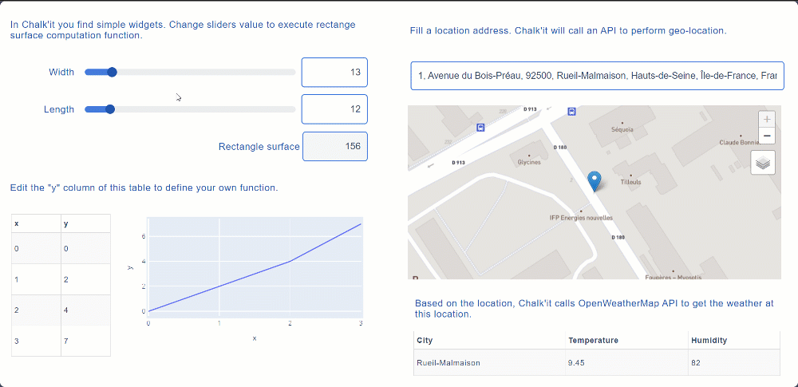
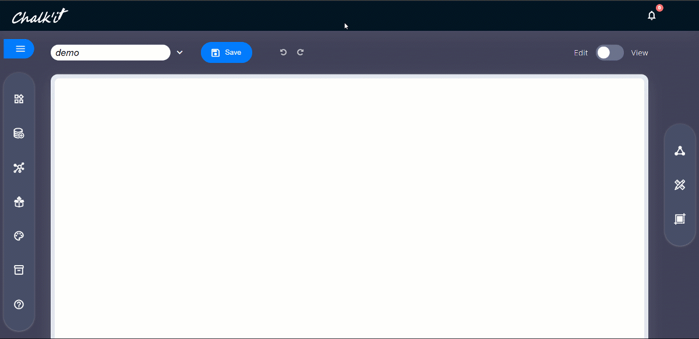
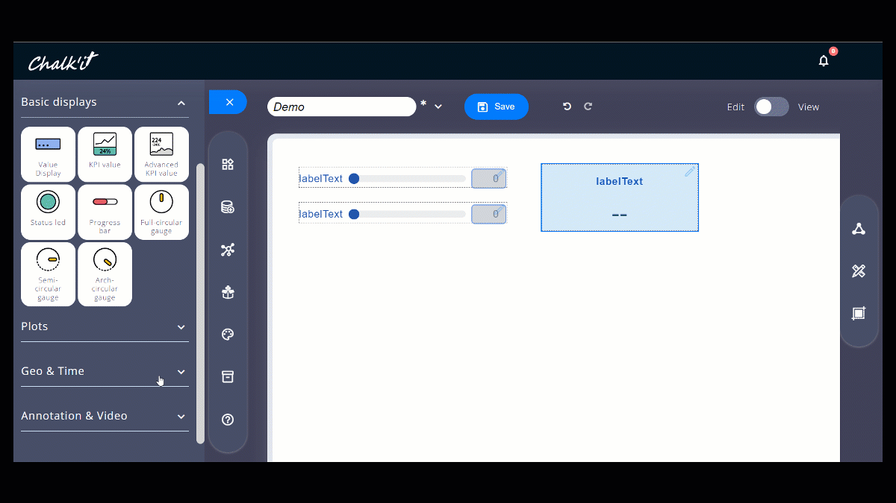
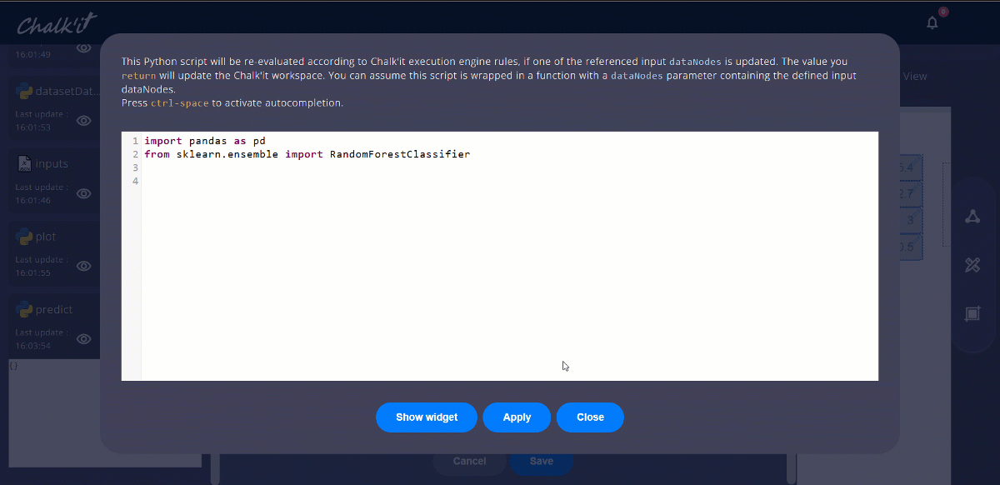
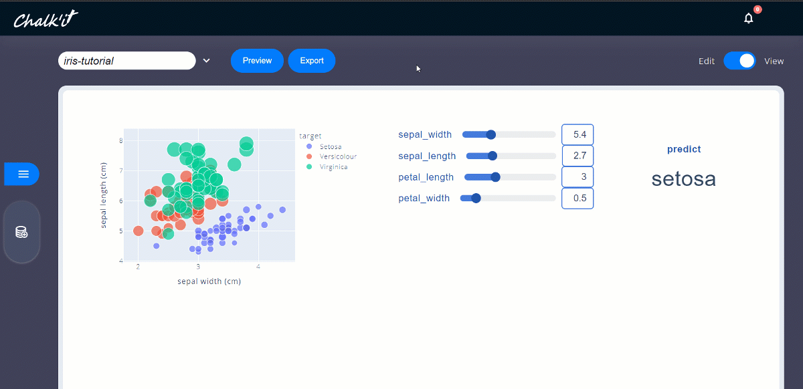

# Taipy Designer

Welcome to Taipy Designer. Taipy Designer ambition is to allow technicians, scientists or engineers, not specialists in web technologies, to build their own web applications based on the Python code, JavaScript code or web-services they develop. Watch this 5 minutes video for a quick introduction: <https://www.youtube.com/watch?v=vY8I1XwKs9k> or this more detailed demo: <https://www.youtube.com/watch?v=4O2IfRogeCc>.



Currently, Taipy Designer allows to export and share standalone HTML apps with Python and/or JavaScript code, thanks to Pyodide.

See the [demos gallery](https://ifpen.github.io/chalk-it/index.html#porfolio) and [templates gallery](https://ifpen.github.io/chalk-it/templates-gallery/) for examples with code.

For more details, you can browse the online [documentation](https://ifpen.github.io/chalk-it/hosted/doc/)

## Usage

### Install

```sh
pip install py-chalk-it
```

### Run

```sh
chalk-it
```

Taipy Designer will be automatically launched in your web browser.

Your can also use the [online hosted version](https://ifpen.github.io/chalk-it/hosted/).

### Add needed Python (Pyodide) librairies



### Add widgets by drag and drop


### Use your favorite librairies



### Create interaction and orchestration dataflow



### Export and share in one click



## Roadmap

- Working with your favorite code editor !
- Local Python code execution (no Browser or Pyodide limitations)
- More widgets
- Enriched framework (adding state, cache …)
- Dashboard themes
- 3 clicks dashboard cloud sharing
- Mixing Pyodide and classic Python execution
- Command line interface (project open, render ...)
- PyDeck support

## Contributing

If you are a developer, and wish to contribute, please read the [contribution rules](CONTRIBUTING.md).
 
