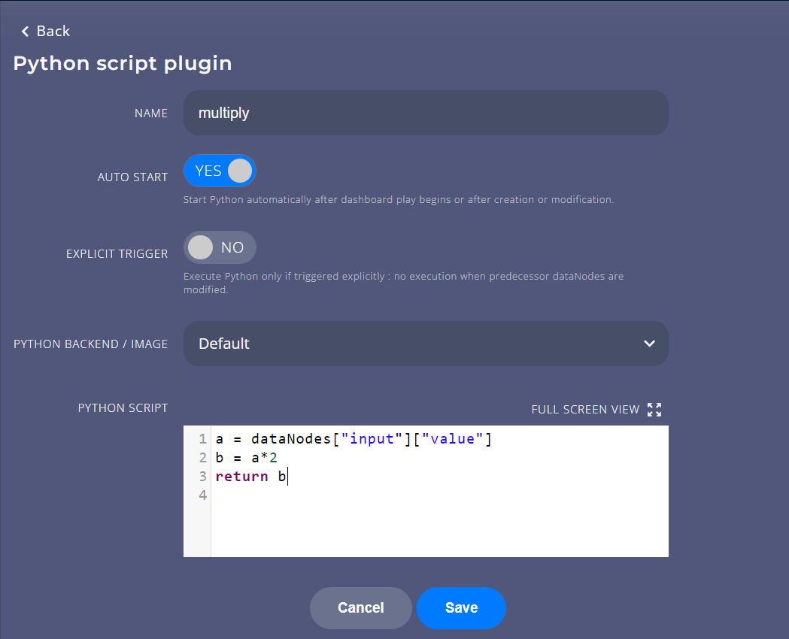

# Basics

## Variable

Variable is the *cornerstone* of Chalk'it. With the **Variable** dataNode type, a JSON, an array or a primitive variable can be manually defined or read from file.

A variable is readable and writable : its value can be *modified by a widget*. This makes Chalk'it different from other tools that only perform data visualization.

The user can import a JSON variable from a file, export it to a file, or manually edit the parameters using the tree editor located in the lower portion of its edition panel.

Simple example :
[simple-json.xprjson](xprjson/simple-json.xprjson)

## Scripts

Script-type dataNode is used to write specific Python or JavaScript code that will be executed on the client side. It may use the output of the other dataNodes (referenced using keyword `dataNodes`). Currently, there types of Script dataNodes exist in Chalk'it :

- [Python Script](ds-reference.md#python-script)
- [JavaScript Script (client-side)](ds-reference.md#javascript-script)

Below is a screenshot of a Python Script edition panel :

In this example, dataNode `multiply` references the dataNode `input`, specifically its property named `value`. This is specified using the keywords `dataNodes["input"]["value"]`.

A final `return` statement is required to return the result of the Script evaluation to Chalk'it workspace.

The code is executed according to [Chalk'it runtime rules](ds-execution-engine.md).

Two run mode are available for Python scripts
- Using the *Default* runner that executes locally the Python code into a worker
- Using the *Pyodide* runner that executes the Python code into a webworker runner in the browser

## Sequencing

* Chalk'it keeps track of a global dependency graph (a Direct Acyclic Graph). This graph specifies both data and execution dependencies between dataNodes.
* When a dataNode output changes, all dependent (i.e. subsequent) dataNodes are automatically re-executed.

A click on the Script dataNode graph icon displays the dependency graph for the formula dataNode.

A click on the graph icon display the complete project graph as shown in the picture below.

This dependency graph above describes the relationships of the dataNodes `input` and `multiply` above.

