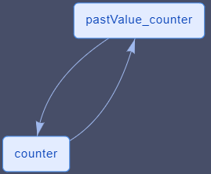

# Reference

DataNodes of type [Variable](ds-basics.md#variable) was described in the basics section.

In the following, we describe the remaining dataNode types of Chalk'it.

| Type                                                  |
| ----------------------------------------------------- |
| [Variable](ds-basics.md#variable)                     |
| [Python Script](#python-script)                       |
| [JavaScript Script (client-side)](#javascript-script) |
| [REST web-service](#rest-web-services)                |
| Generic text file reader                              |
| Generic binary file reader                            |
| [CSV file reader](#csv-file-reader)                   |
| [CSV file player](#csv-file-player)                   |
| [Geolocation](#geolocation)                           |
| [Clock](#clock)                                       |
| [Delay](#delay)                                       |
| [Memory](#memory)                                     |
| MQTT                                                  |
| [WebSocket receive](#websocket-receive)               |
| [WebSocket send](#websocket-send)                     |

## Python Script

It allows the evaluation of a Python script in a local runner (default runner) or in client-side using [Pyodide](https://pyodide.org/). Executed Python in client-side code may use the librairies available for installation in the _Project librairies_ main tab. For further information, please read the [Client-side execution with Pyodide](../py/py-pyodide.md)

Some examples:

- [formula-py.xprjson](xprjson/formula-py.xprjson)
- [rest-pandas-pyodide-covid.xprjson](../py/xprjson/rest-pandas-pyodide-covid-js-py.xprjson)
- [plotly-python-widget-py.xprjson](../py/xprjson/plotly-python-widget-py.xprjson)

## JavaScript Script

Similar to Python Script-type dataNodes, it is possible to write JavaScript code referencing other dataNodes, and producing JSON output to the workspace.


Simple example :

- [formula-js.xprjson](xprjson/formula-js.xprjson)

## REST web-services

The dataNode type **REST Web-service** is used to call functions exposed as [REST web-services](https://en.wikipedia.org/wiki/Representational_state_transfer). Input arguments may come from Chalk'it workspaces (referenced using keyword `dataNodes`). The response is then evaluated in the workspace, if the call was successful.

Typically, the information required to write the dataNode comes from the web-service API documentation. It may use [Swagger](<https://en.wikipedia.org/wiki/Swagger_(software)>).

### Parameters

#### URL

The URL of the HTTP request.

The following examples illustrate Chalk'it syntax for path and how to use code to modify query arguments passed in URL.

#### xProxy

xProxy concept was inspired by [ThingProxy](https://github.com/Freeboard/thingproxy).

It allows to overcome web-browser [CORS (Cross-Origin Resources issues)](https://developer.mozilla.org/en-US/docs/Web/HTTP/CORS) restrictions. As Chalk'it runs on a web-browser, it is subject to browser's CORS policy.

Please disable xProxy if you call a localhost or private network webservice.

### Some examples

#### Simple GET

- [webservice-get.xprjson](xprjson/webservice-get.xprjson) : this is a simple GET example with no input arguments.

#### Simple POST

- [webservice-post-simple-js.xprjson](xprjson/webservice-post-simple-js.xprjson): this is a simple POST example with _body_ as a JSON.

#### GET with arguments

- [webservice-get-args-js.xprjson](xprjson/webservice-get-args-js.xprjson): this example illustrates a GET call where arguments (custom path and query arguments) are defined using the _urlAppend_ object in the _body_ field.

#### GET with arguments from another dataNode

- [webservice-get-input-py.xprjson](xprjson/webservice-get-input-py.xprjson) and [webservice-get-input-js.xprjson](xprjson/webservice-get-input-js.xprjson): in this example, two variables defined in a [variable](ds-basics.md#variable) dataNode are used as inputs to the GET web-service call.

#### GET of a binary file

- [xls-from-url-to-json-py.xprjson](../recipes/xls-from-url-to-json-py.xprjson) : an excel file is read from a remote URL and its content displayed.

#### POST with arguments from another dataNode

- [webservice-post-input-py.xprjson](xprjson/webservice-post-input-py.xprjson) and [webservice-post-input-js.xprjson](xprjson/webservice-post-input-js.xprjson): in this example, two variables defined in a [variable](ds-basics.md#variable) dataNode are used as inputs to the POST web-service call.

#### Triggered POST

- [webservice-post-input-triggered-py.xprjson](xprjson/webservice-post-input-triggered-py.xprjson) and [webservice-post-input-triggered-js.xprjson](xprjson/webservice-post-input-triggered-js.xprjson): if the [explicit trigger](ds-execution-engine.md#explicit-trigger) option is checked, the dataNode is only executed when an explicit click is performed (using a connected [push button](../wdg/wdg-basic-inputs.md#push-button) widget or the update button). When predecessors change, the dataNode execution is no longer triggered. This feature is useful for building form-like interfaces. See also [Execution flow control parameters](ds-execution-engine.md#execution-flow-control-parameters)


## CSV file reader

Reads a CSV file and translates its content to JSON, according to the value of _ROW TO ARRAY_ property :

- If set to _true_, each row of the CSV file will be placed into a JavaScript Array.

  See example: [csv-array.xprjson](xprjson/csv-array.xprjson)

- Otherwise, if set to _false_, content is parsed as an array of JSON objects.

  See example: [csv-json.xprjson](xprjson/csv-json.xprjson)

The following CSV:

```csv
"lat","lng","CH4"
48.876684, 2.175765, 1.94
48.876684, 2.175765, 1.95
48.876684, 2.175765, 1.92
48.876705, 2.175806, 1.93
48.876705, 2.175806, 1.99
```

when _ROW TO ARRAY_ is _true_, is translated to:

```javascript
{
    "lat": [
        48.876684,
        48.876684,
        48.876684,
        48.876705,
        48.876705
    ],
    "lng": [
        2.175765,
        2.175765,
        2.175765,
        2.175806,
        2.175806
    ],
    "CH4": [
        1.94,
        1.95,
        1.92,
        1.93,
        1.99
    ]
}
```

otherwise, it is translated to:

```javascript
[
  {
    lat: 48.876684,
    lng: 2.175765,
    CH4: 1.94,
  },
  {
    lat: 48.876684,
    lng: 2.175765,
    CH4: 1.95,
  },
  {
    lat: 48.876684,
    lng: 2.175765,
    CH4: 1.92,
  },
  {
    lat: 48.876705,
    lng: 2.175806,
    CH4: 1.93,
  },
  {
    lat: 48.876705,
    lng: 2.175806,
    CH4: 1.99,
  },
];
```

An example of table display of this CSV file is given here: [csv-array-table-display.xprjson](../apps/xprjson/csv-array-table-display.xprjson).

It combines a [CSV file reader](#csv-file-reader) as well as a [JavaScript Script](#javascript-script) using the [Lodash library](https://lodash.com/).


## CSV file player

Acts as a player of CSV file. Its behaviour depends on the _TIME INCLUDED_ parameter:

- If set to _false_, play starts from the first row. On each _SAMPLING TIME_, the current row is output in JSON format and the pointer moves to the next row. See example [csv-player.xprjson](xprjson/csv-player.xprjson).

- Otherwise (i.e. _TIME INCLUDED_), the first row is considered as a time vector.

## Delay

Applies a one-step delay to its input defined in the **INPUT SIGNAL** field.

On the first execution, its output is set to the JSON value defined in the **INIT VALUE** field.

Example with [Clock](#clock) and [Delay](#delay) : [clock-and-delay.xprjson](../apps/xprjson/clock-and-delay.xprjson).

## Memory

Gets the previous value of a dataNode defined in the selected value of the **DATANODE ORIGIN** combobox. Its name is automatically generated by adding the prefix \_pastValue\_\_.

On the first execution, its output is set to the JSON value defined in the **INIT VALUE** field.

This special dataNode exhibits a distinct behavior compared to other dataNodes, as it doesn't follow the typical data flow execution. Specifically, when its **DATANODE ORIGIN** is executed, the memory is initiated at the subsequent scheduler start (of the same disconnected graph).

With Memory dataNode, user can create counters for example, without adding real cycles in the graph.

See example: [memory.xprjson](xprjson/memory.xprjson).

In this example, the cycle between "_counter_" and "_pastValue_counter_" is a non-algebraic cycle, because of the special memory type.



## Clock

Gets the value of the JavaScript clock from the web-browser which is running the Chalk'it app:

```javascript
{
    "numeric_value": 1556898500713,
    "full_string_value": "03/05/2019 à 17:48:20",
    "date_string_value": "03/05/2019",
    "time_string_value": "17:48:20",
    "date_object": "2019-05-03T15:48:20.713Z"
}
```

Example with [Clock](#clock) and [Delay](#delay) : [clock-and-delay.xprjson](../apps/xprjson/clock-and-delay.xprjson).

## Geolocation

This dataNode gets the current geographical position of the device, using the GPS sensors if available.

For privacy reasons, authorization is requested from the user to report its position. It also requires Chalk'it to operate under the https protocole.


DataNode produces the following output.


Its output value is updated automatically according to the device position and movement.

Example with **Geolocation** dataNode and [Leaflet Maps](../wdg/wdg-geo-time.md#leaflet-maps) widget which displays your location : [osm-geojson-geolocation.xprjson](../apps/xprjson/osm-geojson-geolocation.full.xprjson) .

## WebSocket

These dataNodes offers support for the [WebSocket protocol](https://en.wikipedia.org/wiki/WebSocket), which is supported by most web browsers to offert real-time data exchange capabilities. It provides full-duplex communication channels over a single TCP connection.
WebSocket in Chalk'it is implemented as client. It needs to communicate with remote WebSocket server.

### WebSocket receive

Acts as a WebSocket client receiver for Chalk'it.


- _Remote IP address_ : The IP address or host name for your remote WebSocket sender.
- _Remote IP port_ : The port to connect to your WebSocket sender.
- _Initialization token_ : Keep to **None** for most applications.
  - None : nothing is sent to the web server during initialization of exchange.
  - xMOD : support to xMOD software. The token "ws_init" is sent once to the xMOD WebSocket server during initialisation of exchange.
- _Decoding options_ : decoding options applied on response data sent by your WebSocket sender.

| options            | Description                                                                         |
| :----------------- | :---------------------------------------------------------------------------------- |
| JSON               | Received data are in JSON format                                                    |
| Int8Array          | Received data are an Array of integer 1 byte                                        |
| Uint8Array         | Received data are an Array of unsigned integer 1 byte                               |
| Int16Array         | Received data are an Array of integer 16 bits                                       |
| Uint16Array        | Received data are an Array of unsigned integer 16 bits                              |
| Int32Array         | Received data are an Array of integer 32 bits                                       |
| Uint32Array        | Received data are an Array of unsigned integer 32 bits                              |
| Float32Array       | Received data are an Array of float 32 bits (IEEE 754 single precision)             |
| Float64Array       | Received data are an Array of float 64 bits (IEEE 754 double precision)             |
| ArrayBuffer2String | Received data are an Javascript ArrayBuffer and transform to string inside Chalk'it |

### WebSocket send

Acts as a WebSocket client sender for Chalk'it.


- JSON/JAVASCRIPT INPUT : The data sent by this dataNode to the **WebSocket receiver**. Data are sent without any modification. In the following example, the dataNode reads the value of "Item" property from the "SelectedCmd" dataNode and send this value to the remote WebSocket receiver as a 32-bit float.

### Example

Follow instructions below to first build a WebSockets test server.

- Install Node.js from <https://nodejs.org/>
- Download Node.js server example [simpleWS.js](ws/simpleWS.js)
- Install _ws_ library used in _simpleWS.js_ server

  ```sh
  npm install ws
  ```

- Run the WebSockets server

  ```sh
  node simpleWS.js
  ```

- The server should be ready and display the following message:


- Open the [websocket-demo.xprjson](ws/websocket-demo.xprjson) example with Chalk'it.

- Switch to **View** mode.
- Test the communication with the server.

  - The server should display:

    

  - Chalk'it should display:

    
