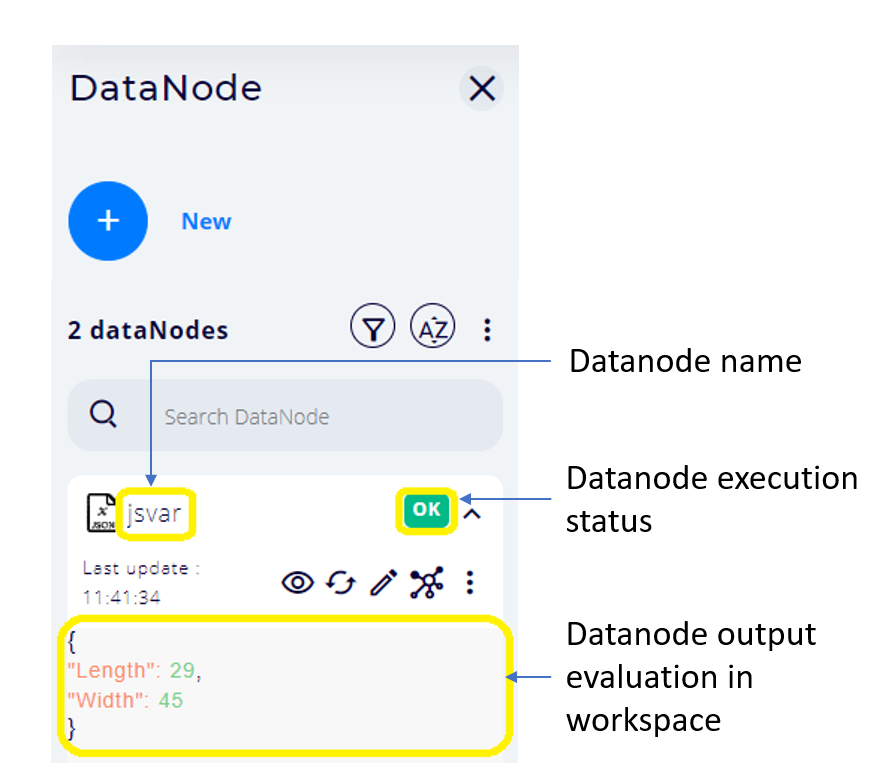

# DataNodes

DataNodes are functions or variables that produce JSON or Python objects into the workspace.

Chalk'it maintains a workspace of these objects whose content corresponds to the latest dataNodes evaluation.

Chalk'it allows the user to specify a dataflow diagram of both data and execution dependency relationships between dataNodes. This constitutes the application logic.

* [Basics](../../ds/ds-basics/)
* [Execution engine](../../ds/ds-execution-engine/)
* [Reference](../../ds/ds-reference/)
  