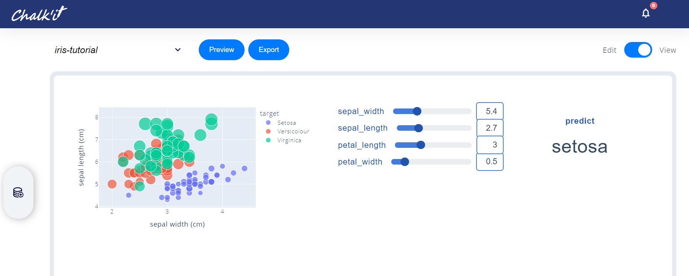
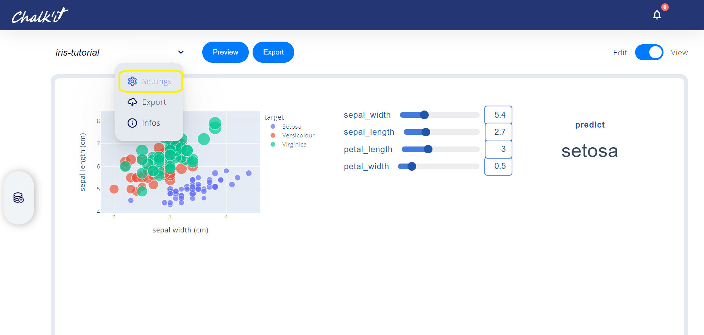
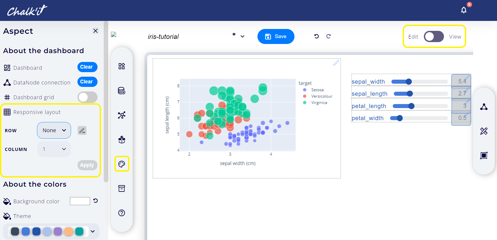
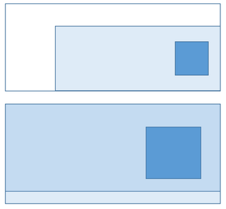
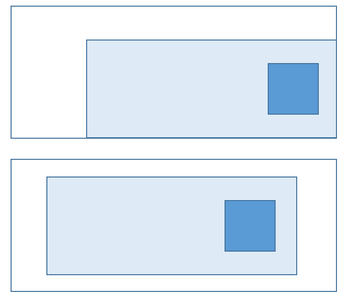
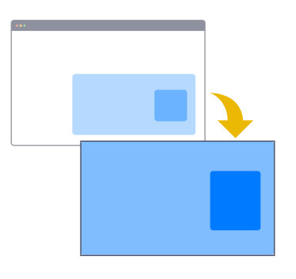
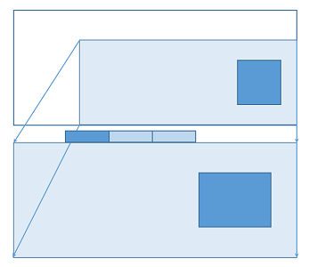
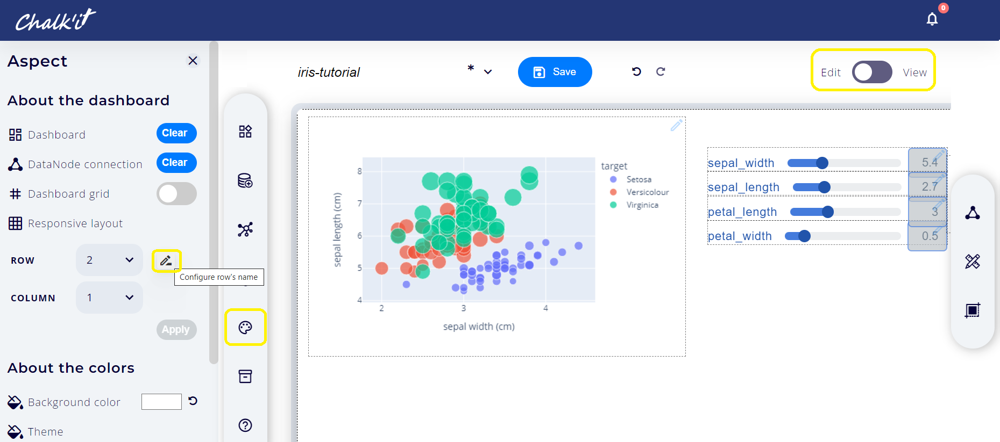
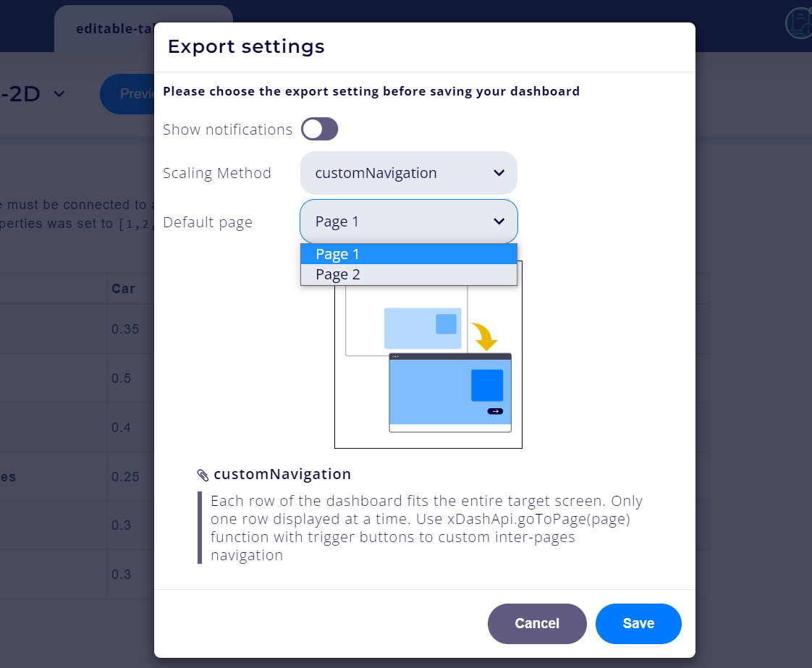

# Application export

An Chalk'it project may be:

- previewed in full-page view
- exported to a standalone html page on the local disk. Running this page from disk have many limitations, due to security restrictions of the browser. Pyodide workers are disabled. Some fonts are also blocked. Use this mode for JavaScript-only dashboards, for local tests.
- deployed as Docker images. See [Docker deployment](#docker-deployment) section for more information.

These features are available in the dashboard _view_ mode:



As dashboard edition zone is smaller than the full window, Chalk'it provides several scaling methods, available under the settings menu shown below:



Available _export settings_ depend on the _responsive layout_ configuration defined in the _edit_ mode:



- If _Row_ is set to none, the dashboard is **unconstrained**. Available scaing methods are [adjustToFullWidth](#adjusttofullwidth), [ajustToTargetWindow](#ajusttotargetwindow) and [keepOriginalWidth](#keeporiginalwidth)
- If _Row_ is set a a numeric value (1,2...), the dashboard in edition mode is organized according to this **constrained** layout. In the target dashboard, each row is projected to the target full page. Several pagination methods are available, including: [projectToTargetWindow](#projecttotargetwindow), [rowToPage](#rowtopage), [rowToTab](#rowtotab) and [customNavigation](#customnavigation)

## Scaling methods for the unconstrained dashboard

### adjustToFullWidth

- The dashboard is stretched widthwise to fit the width of the target screen.
- The height of the widgets is calculated so as to preserve their proportions (in pixels).
- User should use this method rather than the _ajustToTargetWindow_ method if the widgets proportions must be preserved (in pixels), e.g. to avoid distortion of an image.
- Of course, a vertical overflow (with vertical scroll bar) is possible in this mode.



### ajustToTargetWindow

- Similar to the _adjustToFullWidth_ method, but the widgets proportions are not preserved.
- Dashboard viewport proportion, from the width and height dimensions, are preserved.
- This method is useful to keep the same dashboard content heightwise.


### keepOriginalWidth

- Original viewport dimensions of the dashboard are preserved. Dashboard is centered.



## Scaling methods for the constrained dashboard

### projectToTargetWindow

- This method makes the whole dashboard fits the entire target screen.
- The original dashboard (in edition mode), seen with its scroll dimensions, is "projected" into the target screen.
- Target screen has no overflow (no scroll bars).
- Widgets proportions are not preserved.
- User should use this method when rows are defined in responsive layout, as each row will be projected into the target screen (for large target screens).
- For small target screens, each column will be projected into the target screen.
- This method is not suitable if the scroll height of the original dashboard is approximatively greater than 130 % of the original screen, when no row is used.



### rowToPage

Each row of the dashboard fits the entire target screen. Only one row displayed at a time. A pagination system is included.


### rowToTab

Each row of the dashboard fits the entire target screen. Only one row displayed at a time as a page tab.



Tab names have to be be defined in the _Configuration of each row's name_ modal in the _Dashboard aspect_ main tabset:



### customNavigation

Custom navigation mode is the most flexible multi-page mode. For navigation between pages, user needs to use button widgets connected to a JavaScript Script datanode including navigation instructions:

```JavaScript
chalkit.goToPage(2);
return true;
```


Default start page needs also to be indicated:



## Security considerations

When a HTML page is generated with Chalk'it, either exported, public or private, the xprjson content is inlined into the HTML page code, and might include sensitive information such as passwords, API keys, authorization information...

Safely handling secrets is currenly outside Chalk'it scope.

## Docker deployment

Rename your dashboard file to `dashboard.xprjson` and deploy it using Docker.

Use this Dockerfile:

```Dockerfile
FROM python:3.11

# assume your application is named application.xprjson
COPY application.xprjson application.xprjson

# install py-chalk-it and gunicorn
RUN pip install py-chalk-it gunicorn

# this configuration is needed for your app to work, do not change it
ENTRYPOINT ["gunicorn", "chlkt.render:app", "run", "--bind", "0.0.0.0:80"]
```

Build the docker image:

```sh
docker build . -t application
```

Run it:

```sh
docker run -p 5000:80 application
```

Your dashboard will be displayed on port 5000.