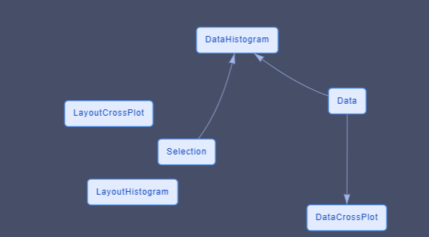

# Select and Filter data

**Selection** and **Filter** are important tools in interactive data analysis and visualisation.

With Plotly JavaScript generic graph, the Chalk'it platform gives you access to selected events which contain all fields necessary in order to use selected element in the dataflow (transfer selection to another graph, filter data according to selection, ...)

> For those familiar with Plotly select events, "appendix I" will explain how xDash selection events are created.

## main data and global index

When user wants to create a graph from a selection of another graph, or to transfer the selection from one graph to another (or from one graph to a script), there is a logic of a main shared data.

This could be the result of a CSV import, a global JSON or GeoJSON.

This shared data is considered and referenced as the global data in our exemples and will be present in the dataNode [data].

Each global shared data is indexed (In the CSV exemple, the index is the lane of each datum) and we will use the term "global index" as a generic expression to reference this main indexation.

## How to use the selection from a graph to draw another one

First example :

- [selection-example-1.xprjson](/wdg/selection/selection-example-1.xprjson)

In this first exemple we :

- Plot all data in one scatter plot graph (Plotly Generic)
- Recover the selection from the scatter
- Build an histogram using only the selected data

The main data is an array of datum that each contains 3 values [Alpha, Beta, Delta]. Typically obtained from a CSV import. The cross plot will be done between [alpha vs beta] and [delta] will be used to draw the histogram.

The dataFlow contains 5 dataNodes and 2 associated widgets

- One DataNode that contains the global data.
- Two DataNodes are created for each Plotly Graph (data and layout)
- One DataNode which contains the selection
- One widget [plotly generic] is the scatter plot
- One widget [plotly generic] is the histogram

The data for the Plotly histogram is dependant of the selection DataNode.

> The graphs and DataNodes associated (PloltlyData and PlotlyLayout) dont know each others and dont have direct relationship.

In order to have a clean change in the histogram, the X axis limit and bin limits are defined via all the data.

## How to draw a graph with different sources of selection

Now, lets imagine that what you want to draw is defined by the addition of different incoming selections.

Example 2:

- [selection-example-2.xprjson](/wdg/selection/selection-example-2.xprjson)

In Exemple 2

- We draw 2 scatter plots
- Both selection are used to draw the histogram.

This exemple is similar than the last one except that :

- the selection datanode has now one field for each cross plot selection
- one dataNode is now present to process the selection [MultiSelectionProcess]

The process node does the addition of each selection.

The structure of the selection node has changed, there is now one field for each graph which will aggregate their selection.

Each selection actuator from the cross plot now is now linked with one field of the selection node.

> It is relevant that the code of the process DataNode dont know the number and the origin of each incoming selections. You can so add and remove origin of selection without changing the code of the process datanode

The PlotlyData datanode used for the histogram takes information from the process node.

> A datanode is used to collect information and create the "global" selection. This is not done in the datanode used for plotly data. This global selection could be used for other graphs or script without copy/paste.

## How to synchronize selection to have a single global selection

The different selection on each graph are independant.

In some case we want a "global" selection" which regroup all selection and that all graph show the selected data.

Example 3

- [selection-example-3.xprjson](/wdg/selection/selection-example-3.xprjson)

In this exemple we do 2 scatter plots from the same global data.
As exemple 2, we use a process node to concatenate the information but on both graphs we want to see all the selected data.

Plotly graphs are mainly correlated with their own selection.

> Trying to use the "selectedpoints" field present in plotly data is a bad idea. This fied is ok if the graph dont has his own selection behavior. But this field is erased when using "rectangle" or "lasso" selection. It is better to consider external selection as a complement of the possible present selection. "appendix II" will enter deeper in exposing the selection

The additional selected items are not drawn last, so we see clearly a difference between the selection from the graph and the selection from other sources. In next exemple we propose a solution to handle this.

## How to use the selection event if the index selected are different from the data index

Example 4:

- [selection-example-4.xprjson](/wdg/selection/selection-example-4.xprjson)

For the moment, in the different exemples we have assumed that the [index] given by the selection is the same that the index of the data.

It means that if the data selected is "4" it is the same index on the global data index.

But it is not always the case, for multiple reasons, the index given by the selection could be different, for exemple

- you need to draw only a part of the data
- you need to sort the data X vs Y in order to draw a line
- you need to sort the global data before drawing in order to control
  the Z order of the draw
- ...

Each plotly trace contains a [customdata] field that can help us to resolve this problem

In exemple [nom de l'exemple] we used the same But in the data for plotly DataNode we order the drawn order with all selected data at the end.

> it is not possible to give a drawn order to plotly (V2.16.3). The element and the trace are drawn in the order given by the user. Last element of last trace are drawn last.

In the data for plotly Datanode we sort the element but we keep the change in an array called "orderForGraph" which will be transfer to plotly in the "customdata" field. This field is present in the selection of the dataflow and can be used in the selectionProcess node to obtain the equivalent index.

## Create a reset selection action

Example 5:

- [selection-example-5.xprjson](/wdg/selection/selection-example-5.xprjson)

in our exemple, selection is in an independant DataNode, and no more only a graphical features.

In order to reset the selection, we need to clean all the DataFlow and all the graphics. In exemple 5 we create a reset selection script which is triggered by a push button.

3 significant addition in the dataNode have to be done in order to have a clean result.

- Reset the DataNode [Selection] via the chalkit function _chalkit.setVariable_. This will reset the selection and the plotly data (done in [ResetSelection] dataNode)

- Add the field "selections : []" in all layout impacted in order to remove all the visible rectangle or lasso drawn
- Create a relation between the resetSelection action script and the different layout to trigger the layout dataNodes.

## Good Practices

### Create one datanode for the layout and one for the data

If one dataNode is used to give the Data and the Layout for the widget, some unexpected graphical behavior can happen.

Usually data often change according to action, but user like to keep element of visualisation (zoom, factor, element selected, ... )

When data changed, plotly will also reset the layout if they are in the same datanode, which can change your view according to what is defined in the original layout.

### Never use the same layout DataNode for multiple graphs.

Plotly keeps in memory each layout for its own internal use. It never makes copy.

If the same layout is used for exemple for 2 scatter plots each pan/zoom/selection done on one plot ... will be passed to the other graph but not at the same time.

The repercution will be done next time plotly via the dataFlow needs to check the current layout.

And you dont know when it will happens (often when the widget is selected)

<<<<<<< HEAD:documentation/docs/wdg/selection/plot-selection.md

## Appendix 1 : Plotly Selection and Chalk'it Selection

=======

## Appendix 1 : Plotly Selection and xDash Selection

> > > > > > > master:HowTos/docs/wdg/selection/plot-selection.md

Structures of the plotly selection are discribe in

[https://plotly.com/javascript/plotlyjs-events/#event-data](https://plotly.com/javascript/plotlyjs-events/#event-data)

So plotly selection events are dependant from the kind of the original graph (2D, 3D, map, ...)

Plotly selection cannot directly be transformed in JSON because it is a circular structure.

<<<<<<< HEAD:documentation/docs/wdg/selection/plot-selection.md
Chalk'it selection event is one unified selection containing an array for each trace which contains the index of the element and the metadata if those one were present in the original trace.
=======
xDash selection event is one unified selection containing an array for each trace which contains the index of the element and the metadata if those one were present in the original trace.

> > > > > > > master:HowTos/docs/wdg/selection/plot-selection.md

[curveNumber (trace number)]

- indexSelected : []
- customdata : [] (if customdata field is present in original DataTrace)

<<<<<<< HEAD:documentation/docs/wdg/selection/plot-selection.md
For exemple if you have 2 traces in your Plotly graph, Chalk'it selection would return :
=======
For exemple if you have 2 traces in your Plotly graph, xDash selection would return :

> > > > > > > master:HowTos/docs/wdg/selection/plot-selection.md

[ 0 : {Data : [1, 10, 120, 123], customData: [1, 10, 120, 123]}]
[ 1 : {Data : [1, 10, 120, 123], customData: [1, 10, 120, 123]}]

## Appendix 2 : how to handle all selection behaviors from plotly without creating trouble

In some situation you want to have a total control of filter/selection and the way plotly control the selection can create confusion.

The behavior you need can visualy enter in "conflict" with plotly internal behavior, or can provoke non wanted behaviors.

When you draw a selection via plotly, each attributes dont used the standard fields (color, size, ...) but used the fields that are under the 2 fields "selected" and "unselected" .. and this is true only for plotly graph which accept this fields;

"selected" and "unselected" are used by plotly when

- a "rectangle" selection is done
- a "lasso" selection is done
- if the field "selectionpoints" is given as a plotly data

In those cases, data are divided in two groups (selected and unselected) and are drawn according to these fields. If you dont define them, plotly used internal behavior to create them (mainly reducing the tone and the opacity)

- the "regular" way (for exemple [data][marker] in scatter plot) to
  render graph are no more used when graph is in selection
  mode.
- A "rectangle" or "lasso" selection reset the field "selectionpoints"

In exemple 3 and 4 we want to keep the plotly behavior for drawing and moving selection, but we also want to keep the way we draw things. So we copy the style on the "selected" and "unselected" fields because we want a global selection and not a selection which takes into account only the graph;
