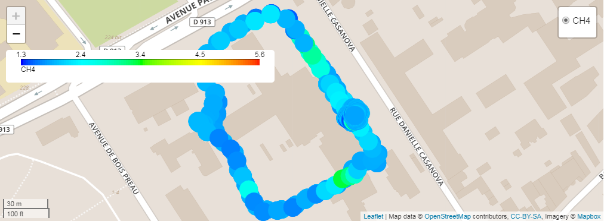
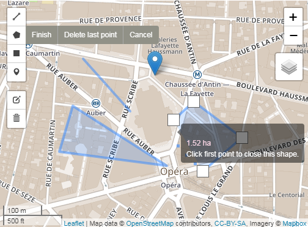
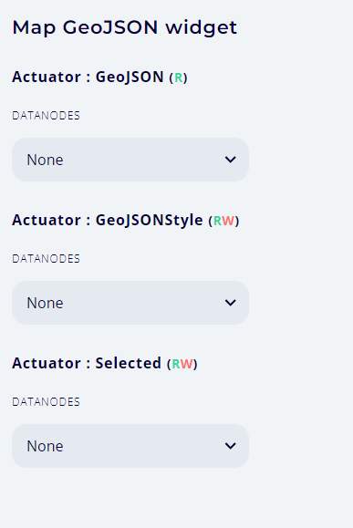
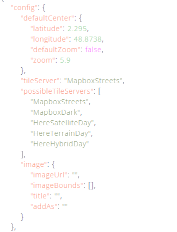
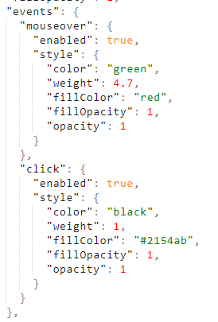
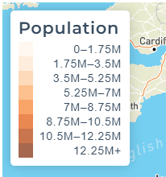
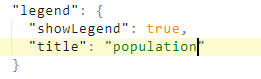
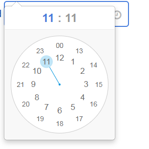

# Geo & Time

This category includes widgets related to location, date and time.

## Leaflet maps

**Leaflet maps** widget has rich and versatile features for displaying various information on maps. It also has selection and interaction features. It is based on [Leaflet](https://leafletjs.com/) library and its various plugins.

When a new **Leaflet maps** widget is added to the dashboard, only one actuator named **geoJSON1** is available in the "Data connection" tab. But this widget allows up to 5 types of display layers, according to the value of the associated parameter _numberOfLayers_. This parameter can be set in the "Graphical properties" tab as shown in the following picture:


Depending on the parametrization, new actuators may appear in "Data connection" tab and offer :

-   0 to 8 possible layers of [GeoJSON](#geojson-layers) objects. Writing GeoJSON objects is described [here](https://en.wikipedia.org/wiki/GeoJSON).
-   0 to 8 possible layers of [heatMap](#heatmap-layers) objects
-   0 to 8 possible layers of [lineHeatMap](#lineheatmap-layers) objects
-   0 to 8 possible layers of [choropleth](#choropleth-layers) objects
-   0 to 8 possible layer of [imageOverlay](#imageoverlay-layers) objects
-   0 to 8 possible layer of [svgOverlay](#svgoverlay-layers) objects

In addition to these pure display layers, selection controls can be activated by enabling the [drawingFeatures](#drawing-features) option. Regions of the map can thus be selected using the mouse. When this option is enabled, the **selectedGeoJson** actuator receives user selection as geoJson, and needs to be connected to a [variable](../ds/ds-basics.md#variable)-type dataNode. This features are based on the [Geoman](https://geoman.io/) plugin.

Enabling the _drawingFeatures_ option enables the **drawingFeaturesOptions** parameters set which manages selection options (point, line, polygon, rectangle).

Other parameters :

-   **offlineSupport** : displays controls on the maps that allow to store tiles for the current displayed geographic area. Useful when using the map offline (i.e. with no Internet connection)
-   **tileServer** : currently there is support for _MapboxStreets_ and _HereHybridDay_

### geoJson layers

geoJson1 to geoJson8 inputs expect a geoJson object. Basic examples are shown below.

#### Point

Single point on a single layer of the map

```javascript
{
  "type": "FeatureCollection",
  "features": [
    {
      "type": "Feature",
      "geometry": {
        "type": "Point",
        "coordinates": [
          2.295,
          48.8738
        ]
      },
      "properties": {
        "html": "See <a href=\"https://en.wikipedia.org/wiki/Place_Charles_de_Gaulle\" target=\"_blank\">Place Charles de Gaulle</a>",
        "awesomeMarker": {
          "icon": "fa-asterisk",
          "prefix": "fa",
          "markerColor": "red"
        }
      }
    }
  ],
  "properties": {
    "description": "Arc de triomphe",
    "disableAutoscale": false
  }
}
```

which will be displayed as :


Properties field of each feature allows to configure it. It comprises the following items :

-   **html** : allows to write html call to be rendered inside the popup.
-   **awesomeMarker** : JSON configuration object for the [Leaflet.awesome-markers](https://github.com/lvoogdt/Leaflet.awesome-markers) library, allowing colorful iconic & retina-proof markers for Leaflet, based on the Glyphicons / Font-Awesome icons. **Only Font-Awesome icons** are supported with xDash.

    | Property     | Description                               | Default Value | Possible values                                                                               |
    | ------------ | ----------------------------------------- | ------------- | --------------------------------------------------------------------------------------------- |
    | icon         | Name of the icon                          | 'home'        | See glyphicons or font-awesome                                                                |
    | prefix       | Select the icon library                   | 'glyphicon'   | 'fa' for font-awesome or 'glyphicon' for bootstrap 3                                          |
    | markerColor  | Color of the marker                       | 'blue'        | 'red', 'darkred', 'orange', 'green', 'darkgreen', 'blue', 'purple', 'darkpurple', 'cadetblue' |
    | iconColor    | Color of the icon                         | 'white'       | 'white', 'black' or css code (hex, rgba etc)                                                  |
    | spin         | Make the icon spin                        | false         | true or false. Font-awesome required                                                          |
    | extraClasses | Additional classes in the created <i> tag | ''            | 'fa-rotate90 myclass' eller other custom configuration                                        |

Examples :

-   Single point : [osm-geojson-point.xprjson](maps/osm-geojson-point.xprjson)
-   Multiple points : [osm-geojson-points.xprjson](maps/osm-geojson-points.xprjson)
-   Awesome markers : [osm-geojson-point-awesome-marker.xprjson](maps/osm-geojson-point-awesome-marker.xprjson)
-   Disable autoscale with geoJSON point : [osm-geojson-point-disable-autoscale.xprjson](maps/osm-geojson-point-disable-autoscale.xprjson)

#### Line

Single line on a single layer of the map

```javascript
{
  "type": "FeatureCollection",
  "features": [
    {
      "type": "Feature",
      "geometry": {
        "type": "LineString",
        "coordinates": [
          [
            2.295,
            48.8738
          ],
          [
            2.321125,
            48.865487
          ]
        ]
      },
      "properties": {
        "style": {
          "color": "#FF0000",
          "weight": 4,
          "opacity": 1
        }
      }
    }
  ],
  "properties": {
    "description": "<span style=\"color: #FF0000\">Champs-Élysées</span>"
  }
}
```

which will be displayed as :


Examples :

-   Single line : [osm-geojson-line.xprjson](maps/osm-geojson-line.xprjson)
-   Multiple lines : [osm-geojson-lines.xprjson](maps/osm-geojson-lines.xprjson)

#### Polygon

A polygon on a single layer of the map

```javascript
{
  "type": "FeatureCollection",
  "features": [
    {
      "type": "Feature",
      "geometry": {
        "type": "Polygon",
        "coordinates": [
          [
            [
              2.300815,
              48.871943
            ],
            [
              2.30158,
              48.864638
            ],
            [
              2.310094,
              48.868996
            ]
          ]
        ]
      },
      "properties": {
        "style": {
          "color": "#01DF01",
          "weight": 4,
          "opacity": 0.9,
          "fillColor": "#01DF01",
          "fillOpacity": 0.4
        }
      }
    }
  ],
  "properties": {
    "description": "<span style=\"color: #01DF01\">Triangle d'or</span>"
  }
}
```

which will be displayed as :


Example :

-   [osm-geojson-polygon.xprjson](maps/osm-geojson-polygon.xprjson)

See also : [Using GeoJSON with Leaflet](https://leafletjs.com/examples/geojson/)

### heatMap layers

_heatMap1_ to _heatMap8_ inputs expect a JSON object like the following one :

```javascript
{
  "data" : [
    {
    "lat": 44.78857833333333,
    "lng": 0.20539333333333332,
    "H2O": 58.0183
    },
    {
    "lat": 44.78858,
    "lng": 0.20539333333333332,
    "H2O": 58.0187
    }
  ],
  "config": {
    "opacity": 0.5,
    "radius": 1,
    "disableAutoscale": false,
    "min": 0,
    "max": 100,
    "colorScale": "interpolateSpectral",
    "reverseColorScale": true
  }
}
```

When **min** and/or **max** config parameters are not specified, they are automatically computed from the data set. **colorScale** is a string from interpolate-type colorscales of D3.js : <https://github.com/d3/d3-scale-chromatic>.

Example of display (for a larger data set) :



Example :

-   [osm-heatmap-view.xprjson](maps/osm-heatmap-view.xprjson)

Several parameters control the display of the heatmap, in particular :

-   **sampledDisplay** : allows to feed the map in real-time with instantaneous measures (single heatmap point). The config of the first point will be used. See corresponding examples:

-   [osm-heatmap-play-py.xprjson](maps/osm-heatmap-play-py.xprjson)
-   [osm-heatmap-play-js.xprjson](maps/osm-heatmap-play-js.xprjson)

### lineHeatMap layers

_lineHeatMap1_ to _lineHeatMap8_ inputs expect a JSON object like the following one :

```javascript
{
  "data": [
    {
      "coordinates": [
        [
          4.84112,
          45.74968
        ],
        [
          4.84091,
          45.74981
        ]
      ],
      "CO2": 6
    },
    {
      "coordinates": [
        [
          4.84138,
          45.74953
        ],
        [
          4.84112,
          45.74968
        ]
      ],
      "CO2": 10
    }
  ],
  "config": {
    "opacity": 0.9,
    "weight": 4,
    "disableAutoscale": false,
    "min": 0,
    "max": 10,
    "colorScale": "interpolateSpectral",
    "reverseColorScale": true
  }
}
```

When **min** and/or **max** config parameters are not specified, they are automatically computed from the data set. **colorScale** is a string from interpolate-type colorscales of D3.js : <https://github.com/d3/d3-scale-chromatic>.

Example of display (for a larger data set) :


Example :

-   [osm-lineheatmap.xprjson](maps/osm-lineheatmap.xprjson)

### Choropleth layers

_choropleth1_ to _choropleth8_ inputs expect a JSON object like the following one :

```javascript
{
  "data": [
    {
      "geometry": {
        "type": "Polygon",
        "coordinates": [
          [
            [
              2.329144745999656,
              48.87299590267482
            ],
            [
              2.329453736347205,
              48.8723745764414
            ],
            [
              2.331221849053691,
              48.8721034501072
            ]
          ]
        ]
      },
      "CO2": 6
    },
    {
      "geometry": {
        "type": "Polygon",
        "coordinates": [
          [
            [
              2.331445008712763,
              48.87264570173727
            ],
            [
              2.332766800791433,
              48.870849470245
            ],
            [
              2.3349983986918237,
              48.87142562719721
            ]
          ]
        ]
      },
      "CO2": 10
    }
  ],
  "config": {
    "opacity": 0.9,
    "weight": 4,
    "disableAutoscale": false,
    "min": 0,
    "max": 10,
    "colorScale": "interpolateOranges",
    "reverseColorScale": false
  }
}
```

When **min** and/or **max** config parameters are not specified, they are automatically computed from the data set. **colorScale** is a string from interpolate-type colorscales of D3.js : <https://github.com/d3/d3-scale-chromatic>.

Example of display (for a larger data set) :


Example :

-   [osm-choropleth-py.xprjson](maps/osm-choropleth-py.xprjson)
-   [osm-choropleth-js.xprjson](maps/osm-choropleth-js.xprjson)

### imageOverlay layers

_imageOverlay1_ to _imageOverlay8_ inputs expect a geoJson object like the following one :

```javascript
{
    "imageUrl" = "http://www.fondation-tuck.fr/upload/docs/image/jpeg/2015-01/logo-ifpen.jpg";
    "imageBounds" = [
        [48.874875, 2.171738],
        [48.877923, 2.179484]
    ];
    "title" = "IFPEN location";
    "addAs" = "overlay"; // overlay or baseLayer
}
```

As shown in the code snippet above, the **addAs** parameter may take two values:
_overlay_ which adds a checkbox control, or _baseLayer_ which adds a radio button control.

Example :

-   [osm-image-overlay.xprjson](maps/osm-image-overlay.xprjson)

### svgOverlay layers

_svgOverlay1_ to _svgOverlay8_ inputs expect a JSON object like the following one :

```javascript
{
  "data":
  [
    {
      "lat": 48.876684999999995,
      "lng": 2.175765,
      "rotation": 255
    },
    {
      "lat": 48.876684999999995,
      "lng": 2.175765,
      "rotation": 256
    }
  ],
  "config": {
    "marker": "arrow",
    "title": "Wind direction",
    "opacity": 0.5,
    "length": 9.3,
    "disableAutoscale": false,
    "addAs": "overlay" // overlay or baseLayer
  }
}
```

Example of display (for a larger data set) :


Example :

-   [osm-svg-layer-view-js.xprjson](maps/osm-svg-layer-view-js.xprjson)

### Drawing features

It is possible to allow the user to manually select points, lines, rectangles or polygon regions in the map. This is possible by enable the _drawingFeatures_ option.



Selection result will be written to the _selectedGeoJson_ actuator.

Example :

-   [osm-drawing-features.xprjson](maps/osm-drawing-features.xprjson)
## Map Geojson 
The **Map GeoJSON Widget** is an alternative to the traditional Leaflet Map Widget. It provides the core functionalities of Leaflet Map but with a declarative approach, making it easier to use and integrate.
 
The widget is built around three main actuators, which are essential for handling and interacting with geospatial data:

-   **GeoJSON**
This actuator contains the GeoJSON data that represents the geographic features to be displayed on the map.

-   **GeoJSONStyle**
When the user switches to View mode, this actuator is automatically populated with a style template based on the characteristics of the provided GeoJSON.
The user can customize this style template to adjust the appearance of the displayed data.

-   **Selected**
This actuator stores the data resulting from a click event on the geographic features. It enables interactions or additional processing based on user clicks.

   

### GeoJSONStyle Structure

The **GeoJSONStyle** actuator is a JSON object divided into two main parts:


**config**: This section manages the global configuration of the widget. It includes:

-   **defaultCenter**: 

    Defines the default center of the map.
    To ensure that the zoom property value is applied, the **defaultZoom** property must be set to **false**.
    If **defaultZoom** is set to **true**, the zoom level is automatically calculated based on the bounds of the GeoJSON data. This allows the map to dynamically adjust its zoom to fit the displayed features. However, when **defaultZoom** is **false**, the zoom level specified in the configuration will take precedence.

-   **Tile Server**: Specifies the default tile server to be used, along with a list of available tile servers.

-   **Image Overlay**: Allows adding an overlay image to the map for additional context or customization.



Example :

- Config Example :  [osm-geojson-config.xprjson](maps/osm-geojson-config.xprjson)
- Image Overlay Example : [osm-geojson-imageoverlay.xprjson](maps/osm-geojson-imageoverlay.xprjson)

**style** :
This is an array containing style templates, where each template corresponds to a specific GeoJSON layer. These templates define the visual appearance of the associated GeoJSON data, enabling customization of how different data elements are displayed on the map.

#### Common Properties  

These apply to all GeoJSON types:

-   **name**: layer name.

-   **color**: Stroke or border color.

-   **opacity**: Stroke transparency level.

-   **fillColor**: Fill color for polygons or shapes.

-   **fillOpacity**: Fill transparency.

-   **weight**: Stroke thickness.

#### Type-Specific Properties  

These properties vary depending on the type of GeoJSON feature:

-   **Point**:  
    - **radius**: Determines the size of the point marker.  
    - **awesomeMarker**: Provides advanced marker styling using the AwesomeMarkers library. It includes:  
        - **enabled**: Enables or disables the use of AwesomeMarkers.  
        - **icon**: Specifies the icon class for the marker (e.g., `fa-asterisk`).  
        - **prefix**: Defines the icon library prefix (e.g., `fa` for Font Awesome).  
        - **markerColor**: Sets the marker's color (e.g., `red`, `blue`). 
    - **markerCluster**: Enables or disables marker clustering (grouping nearby points into clusters on the map).  
    - **enablePopup**: Activates the display of popups for point markers.  
    - **clickPopup**: Configures whether the popup opens on marker click.
    - **popupProperty**: Defines what content is displayed in the popup:  
        - If set to `"default_tooltip"`, the properties defined in the **tooltip** section of the style are displayed.  
        - Otherwise, the popup will display the specified property and its value from the GeoJSON.
    - **pointAreMarker**: Toggles the rendering of points as either markers or circles:
        - If `true`, points are rendered as standard markers.  
        - If `false`, points are rendered as circles, which allows additional customization such as radius and fill properties.

Example :

-   [osm-mapgeojson-points.xprjson](maps/osm-mapgeojson-points.xprjson)

-   **LineString**:  
    - **dashArray**: Defines the pattern of dashed lines. The value is a string representing the length of dashes and gaps, e.g., `"5,5"` for equal-length dashes and spaces.  
    - **lineJoin**: Specifies the shape to be used at the junction of two connecting lines. Common values include:  
        - `"miter"` (default): Creates sharp corners.  
        - `"round"`: Creates rounded corners.  
        - `"bevel"`: Creates beveled corners.
    - **lineCap**: Specifies the shape to be used at the ends of lines. Common values include:  
        - `"square"` (default): Creates square endings at the line ends.  
        - `"round"`: Creates rounded endings at the line ends.  
        - `"butt"`: Cuts the line ends off at the exact endpoint, with no extension beyond the line.

Example :

-   [osm-mapgeojson-lines.xprjson](maps/osm-mapgeojson-lines.xprjson)

#### Properties for Geometries with Fill

  For geometries that include a fill (e.g., polygons, circles, lines), you can dynamically calculate the **fillColor** based on the values of a property in the GeoJSON data. The following properties are used to define the color calculation:

- **fillColor**: Defines the fill color for the geometry.
  - The color can be set using a **normal color** (e.g., `"red"`, `"blue"`) or using a **color scale** from the **d3** library (e.g., `"interpolateViridis"`).
  - To calculate the fill color dynamically from a property, use the following properties:
    - **property**: The property in the GeoJSON data used to calculate the color. This property must be of type **number**.
    - **propertyMin** and **propertyMax**: Define the minimum and maximum values for the color scale calculation. If set to `"Auto"`, these values are calculated automatically based on the property values.
    - **possibleProperties**: An object that defines valid properties and their value ranges (min, max) for calculating the color scale.

Example :

-   [osm-geojson-choropleth.xprjson](maps/osm-geojson-choropleth.xprjson)

#### Event Handling

The widget allows you to configure various events that can interact with the geometries (e.g., points, lines, polygons) displayed on the map. You can define specific styles and behaviors for each event, such as **mouseover** and **click** events. The following properties are used to configure event handling:

#### Events Configuration:

- **events**: Defines the events and their corresponding actions.
  - Each event can have:
    - **enabled**: A boolean indicating whether the event is active or not.
    - **style**: Specifies the style to apply when the event is triggered (e.g., on mouseover or click).




Examples :

-   [osm-geojson-choropleth-events.xprjson](maps/osm-geojson-choropleth-events.xprjson)
-   [osm-geojson-heatmap.xprjson](maps/osm-geojson-heatmap.xprjson)

#### Legend Configuration

The widget provides the ability to display a legend for the map, helping users understand the meaning of colors, symbols, or values represented on the map. The legend can be customized with various properties.



#### Legend Properties:

- **legend**: Defines the configuration for the map's legend.
  - **showLegend**: A boolean that determines whether the legend is displayed (`true`) or hidden (`false`).
  - **title**: Specifies the title of the legend. This can be any text that describes the data represented on the map.
  


#### Tooltip Configuration

The widget allows you to configure tooltips to display information when hovering/clicking on geometries on the map. Tooltips can show specific properties from the GeoJSON data to provide users with additional context.

#### Tooltip Properties:

- **tooltip**: Defines the configuration for displaying tooltips on the map.
  - **properties**: An array of property names from the GeoJSON data that should be displayed in the tooltip. Each property listed here will be shown with its corresponding value.

## Folium Maps

[Folium](https://python-visualization.github.io/folium/) is a Python library used for visualizing geospatial data. It leverages the power of the Leaflet.js library and provides a simple way to create interactive maps. Folium can be used to create various types of maps such as choropleth maps, bubble maps, and scatter maps, and provides an easy-to-use interface for adding markers, popups, and other interactive features to the maps.

Folium is built on top of the Python data analysis library pandas, which makes it easy to manipulate and visualize large datasets. It also supports several tilesets such as OpenStreetMap, Mapbox, and Stamen, which can be used to customize the look and feel of the maps.

Usage examples:

-   [folium-point.xprjson](maps/folium-point.xprjson)

## Address autocompletion

This widget uses the [here geocoder autocomplete API](https://developer.here.com/documentation/geocoder-autocomplete/dev_guide/topics/example-location-id.html) to provide suggestion as the user types an address location.

The parameter _countryIsoCodes_ restricts the provided suggestions to the specifed country.

## Simple calendar

Use the _Simple calendar_ widget to select a date.


Example :

-   [date-picker.xprjson](date-time/date-picker.xprjson)

## Date-range calendar

Enables the selection of a date interval.

## D3 year heatmap caldendar

Allows to associate range heatmap to a yearly-based calendar. Very useful to visually identify sporadic information. Date selection is also possible.


Example :

-   [d3-year-heatmap-calendar.xprjson](date-time/d3-year-heatmap-calendar.xprjson)

## Simple clock

Use the _Simple clock_ widget to select a time.



Example :

-   [time-picker.xprjson](date-time/time-picker.xprjson)
