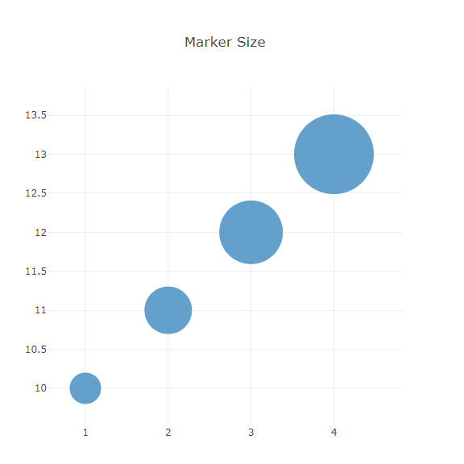

# Plots

Plots in Chalk'it may be made either with Python or JavaScript code:

* Python-based plots are available using [Plolty Python](https://plotly.com/python/) or [Matplotlib](https://matplotlib.org/), currenly only with the [Python Script (Pyodide)](../ds/ds-reference.md#python-script-pyodide)-type dataNode
* JavaScript-based plots are available using  [Plotly.js](<https://plot.ly/javascript/>), [Apache ECharts](https://echarts.apache.org/) or [Vega](https://vega.github.io/vega/)
* Simplified usage (array actuators) is available for [Plotly line](#plotly-line), [Plotly bar](#plotly-bar), [Plotly pie](#plotly-pie) and [Plotly 3D surface](#plotly-3d-surface). Otherwise, use the [Plotly generic](#plotly-javascript-generic) for a complete Plotly.js options and configurations

Plotly.js-based widgets share common parameters, especially *hideModeBar* which allows to hide plot options toolbar at dashboard play.

## Plotly line

Allows to quickly display line charts, when x and y axis are expressed as arrays of numbers. The parameter *numberOfAxis* allows to specifiy up to 8 y-axis actuators (named **y1** to **y8**), sharing the same x-axis actuator (named **x**). Widget layout may be configured in the "Graphical properties" tab.

* [line-chart.xprjson](/wdg/plotly/line-chart.xprjson)


## Plotly bar

Here parameter *numberOfAxis* allows to specify couples of x and y axis actuators (named **x1**, **y1** to **x8**, **y8**).

Some examples :

* [bar-chart.xprjson](/wdg/plotly/bar-chart.xprjson)


* [stack-bar-chart-js.xprjson](/wdg/plotly/stack-bar-chart-js.xprjson)


## Plotly pie

This widget has two actuators :

* **values**: an array of values to be displayed as pie chart
* **labels**: an optional array of labels associated to values


Example :

* [pie-chart.xprjson](/wdg/plotly/pie-chart.xprjson)

## Plotly Real-time

The widget provides a real-time graph for displaying numeric-based dataNode inputs, having a given sample-time.

Example : [real-time-kpi-plotly-js.xprjson](/wdg/plotly/real-time-kpi-plotly-js.xprjson)

## Plotly JavaScript generic

This widget accepts three actuators : **data**, **layout** and **selection**. In opposite to previous Plotly-based widgets, layout cannot be set from "Graphical properties" tab. This brings more expressive power for layout specification using programming dataNodes.

Defining **data** and **layout** is illustrated in [plotly.js documentation](https://plot.ly/javascript/).

Some examples:

* [bubble-chart-js.xprjson](/wdg/plotly/bubble-chart-js.xprjson)



* [plotly-stat-box-js.xprjson](/wdg/plotly/plotly-stat-box-js.xprjson)


The **selection** actuator is detailed in [this topic](selection/plot-selection.md)

## Plotly Python Generic

This widget expects a Plotly figure Python object, produced by a [Python Script (Pyodide)](../ds/ds-reference.md#python-script-pyodide)-type dataNode. Below a code example: 

```python
import plotly.express as px

df = px.data.gapminder().query("country=='Canada'")
fig = px.line(df, x="year", y="lifeExp", title='Life expectancy in Canada')

return fig
```

All receipes may be found in [Ploty Python documentation](https://plotly.com/python/line-charts/).

No call to `fig.show()` is needed because rendering process will be entirely handled by Chalk'it according to its rendering rules.

Example:

- [plotly-density-heatmap-py.xprjson](/wdg/plotly/plotly-density-heatmap-py.xprjson)

## Matplotlib

In the same way as Plotly Python widget, Matplotlib widget expect a figure object as actuator. Below a code example:

```python
import matplotlib.pyplot as plt

fig, ax = plt.subplots()

fruits = ['apple', 'blueberry', 'cherry', 'orange']
counts = [40, 100, 30, 55]
bar_labels = ['red', 'blue', '_red', 'orange']
bar_colors = ['tab:red', 'tab:blue', 'tab:red', 'tab:orange']

ax.bar(fruits, counts, label=bar_labels, color=bar_colors)

ax.set_ylabel('fruit supply')
ax.set_title('Fruit supply by kind and color')
ax.legend(title='Fruit color')

return fig
```

All receipes may be found in [Matplotlib documentation](https://matplotlib.org/stable/gallery/index.html).

- No call to `plt.show()` is needed because rendering process will be entirely handled by Chalk'it according to its rendering rules.

Example:

- [matplotlib-bar-color-py.xprjson](/wdg/plots/matplotlib-bar-color-py.xprjson)

## Vega

In the same spirit as [Plotly generic](#plotly-javascript-generic) widget above, you can visualize [Vega](https://vega.github.io/vega/) specifications and connect them to data from other dataNodes.

Browse [Vega examples gallery](https://vega.github.io/vega/examples/). Copy and paste the appropriate visualization to a [JavaScript Formula](../../ds/ds-reference/#javascript-script) dataNode. Finally, connect this dataNode to the **specification** widget actuator.

In this examples gallery, data is typically read from URL referenced sources using the Vega *url* keyword. You can connect to Chalk'it dataNodes using the Vega *values* keyword instead.

Be aware when copying examples that URLS in these examples use relative paths. For proper execution on Chalk'it, the absolute data path needs to be used (e.g. use 'https://vega.github.io/vega/data/movies.json' instead of 'data/movies.json').

Some examples:

* [vega-les-miserables-js.xprjson](/wdg/plots/vega-les-miserables-js.xprjson)

## ECharts

Simply, copy and paste the needed visualization from [ECharts examples gallery](https://echarts.apache.org/examples/en/index.html) to a  [JavaScript Script](../ds/ds-reference.md#javascript-script) dataNode. This example shall return an *option* JSON according to ECharts grammar. Finally, connect this dataNode to the **option** widget actuator.

Some examples:

* [echarts-covid-comparison-js.xprjson](/wdg/plots/echarts-covid-comparison-js.xprjson)