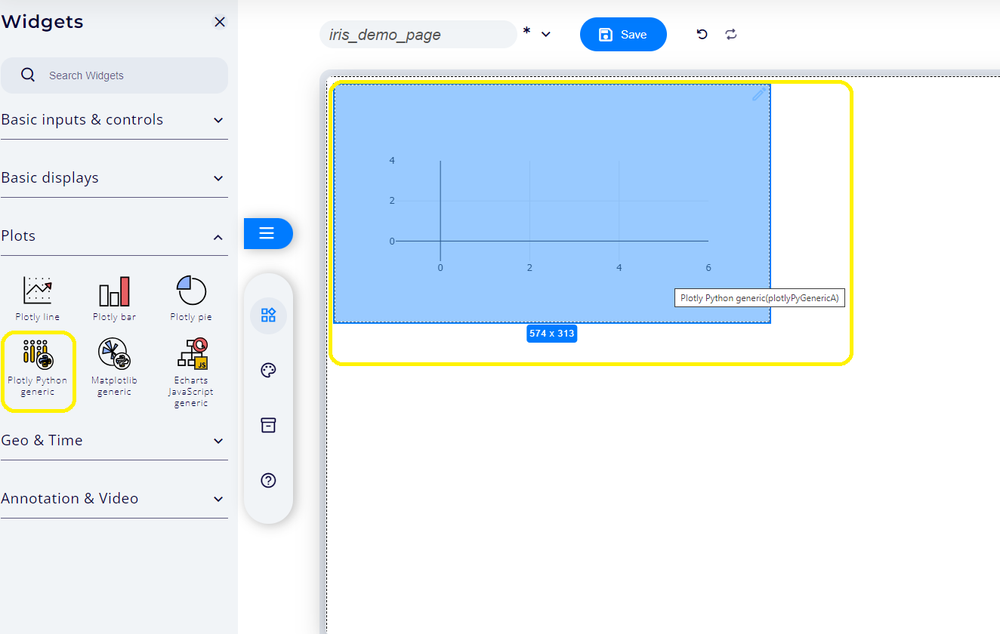

# Quickstart : A journey throught the Iris dataset

## Introduction

The Iris flower dataset is a multivariate dataset introduced by the British statistician and biologist Ronald Fisher in his 1936 paper "The use of multiple measurements in taxonomic problems" as an example of linear discriminant analysis. It consists of 50 samples from each of three species of Iris (Iris setosa, Iris virginica and Iris versicolor). Four features were measured from each sample: the length and the width of the sepals and petals, in centimeters. The Iris dataset is widely used in machine learning as a benchmark dataset for statistical classification algorithms. It is free and publicly avaible at the [UCI Machine Repository](https://archive.ics.uci.edu/ml/datasets/iris).

The following tutorial allows to illustrate main Taipy Designer features througth this dataset. Expected result is provided in the following project:

- [iris_demo.py](/quick-start/xprjson/iris_demo.py)
- [iris_demo_page.xprjson](/quick-start/xprjson/iris_demo_page.xprjson)

## 1. Installing required Python librairies

Begin by creating a file named **requirements.txt** to specify the necessary Taipy Python libraries:

```sh
taipy==3.2.0.dev0
```

Additionally, include the libraries required for the iris example: **pandas**, **scikit-learn** and **plotly**.

```sh
pandas==2.2.1
plotly==5.18.0
scikit_learn==1.4.0
```

Your final file should resemble the following: [requirements.txt](xprjson/requirements.txt)

After defining the requirements, install them using the command:

```sh
pip install -r requirements.txt
```


## 2. Creating an empty projet

To start, create a Python script named **iris_demo.py** and insert the following code:

```python
from taipy.gui import Gui
from chlkt import *

page = DesignerPage("iris_demo.xprjson")

gui = Gui()
gui.add_page("iris", page)
gui.run(run_browser=True, use_reloader=False)
```

Next, execute the following command line:

```Python
python iris_demo.py
```

This command will initialize an empty project that you can save as modifications occur, as illustrated below:


It will also generate the corresponding **iris_demo.xprjson** project file.

## 3. Loading dataset data

With the project created and the necessary Python libraries installed, the next step is to load the Iris dataset from **scikit-learn**. To achieve this, add the following code snippet to your script, creating a variable named **iris**:

```Python
  from sklearn import datasets

  def load_dataset():
    iris = datasets.load_iris()
    return iris

  iris = load_dataset()
```

## 4. Visualizing the dataset

To visualize the dataset, follow these steps:

### Step1: Prepare the data

Begin by loading the dataset into a Pandas dataframe using the following code:

```Python
import pandas as pd

def create_dataframe(iris):
  df = pd.DataFrame(data=iris.data, columns=iris.feature_names)
  df["target"] = iris.target
  target_names = {0: "Setosa", 1: "Versicolour", 2: "Virginica"}
  df['target'] = df['target'].map(target_names)
  return df

df = create_dataframe(iris)
```

Next, visualize the dataset using Plotly Python library by adding the following code:

```Python
import plotly.express as px

def plot_data(df):
  fig = px.scatter(df, x="sepal width (cm)", y="sepal length (cm)", color="target",
                   size='petal length (cm)', hover_data=['petal width (cm)'])
  return fig

fig = plot_data(df)
```

### Step2: Prepare the dashboard

1. Click on the _Widgets_ main tab, then navigate to the _Plots_ category.


2. Add a _Plotly generic_ widget to the dashboard editor: click on the corresponding icon or just perform a drag and drop.



### Step3: connect variable to widget

1. Click on the pencil icon on the top-right corner of the widget to display the widget menu. Select then _Connect widget_ as shown below:

2. A panel will then be displayed on the right-side of the screen. From the first connection dropdown, select the variable _fig_, then its _data_ field as it will provide the plot data needed for the widget. Repeat the process for the _layout_ actuator immediately below, but this time using the _layout_ field of the _fig_ variable. Finally, click _Save_ to validate the choices.


### Step4: Preview the dashboard

A static preview of the figure is then provided. The widget can be moved or resized as needed. The \*View\* mode can be selected to start interactive visualization.


## 5. Interactive predictor with classifier training

The objective now is to utilize the previously trained classifier to predict Iris species based on petal and sepal width and length.

### Classifier training

Begin by creating a variable named **clf** using the following code:

```Python
from sklearn.ensemble import RandomForestClassifier

def train_classifier(iris):
    clf = RandomForestClassifier()
    clf.fit(iris.data, iris.target)
    return clf
clf = train_classifier(iris)

```

### Interactive predictor

Create a variable named **input_data** with the initial values for sepal and petal measurements:

```Python
input_data = {"sepal_width": 5.4, "sepal_length": 2.7, "petal_length": 3, "petal_width": 0.5}
```

Next, add an horizontal slider to control the values of "sepal_width". Navigate to the _Widgets_ main tab, then select _Basic Inputs & Controls_.


Connect the slider to its corresponding feature as illustrated below:


Then, copy paste the slider 3 times and connect each one to its corresponding feature to control also the values of "sepal_length", "petal_length", and "petal_width".

Open the _Dashboard aspect_ tab, select the 4 sliders, then click on the _Align left_ icon to ensure neat appearance:


Configure the sliders with a sliding step of **0.1** and set the minimum and maximum values according to the table below:

| Feature      | min | max |
| ------------ | --- | --- |
| petal_length | 1.0 | 6.9 |
| petal_width  | 0.1 | 2.5 |
| sepal_length | 2.0 | 4.4 |
| sepal_width  | 4.3 | 7.9 |

To adjust these properties, select the _Graphical properties_ tab of each widget:


Add a variable named **prediction** with the following code:

```Python
prediction = '--'
def make_prediction(clf, input_data):
  df = pd.DataFrame(input_data, index=[0])
  prediction = clf.predict(df)
  return iris.target_names[prediction][0]

def on_change(state, var, val):
  if var == 'input_data':
      state.prediction = make_prediction(clf, val)

```

Next, go back to the _Widgets_ main tab, open the _Basic Displays_ tabset, and then add a _KPI value_ widget


Connect this widget to the **prediction** variable.

Switch to \*View\* mode. Use the sliders to change Iris features and view prediction result accordingly:


Note that computation will be triggered every time a slider is changed. The examlpe can be extended to apply the slider changes only after a click on a validation button.

To preview the final page without the edito, click on the _Preview_ button. The final result will appears as follow:

