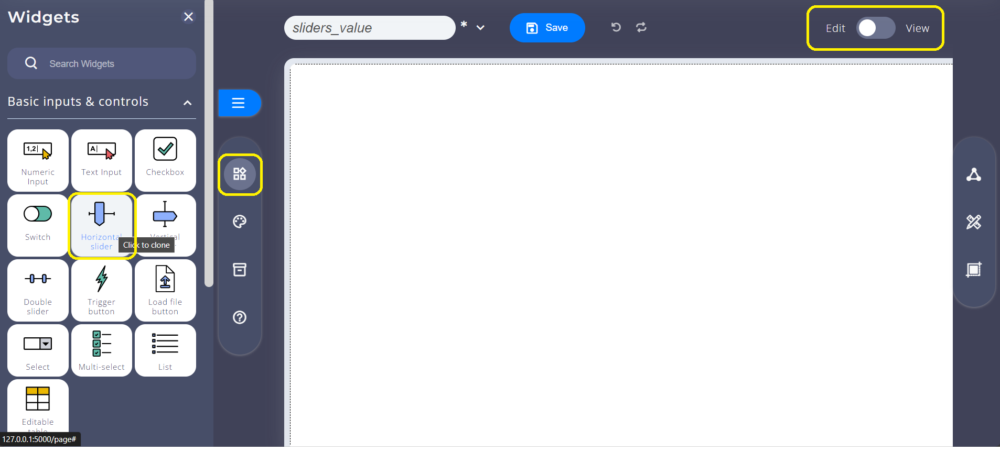
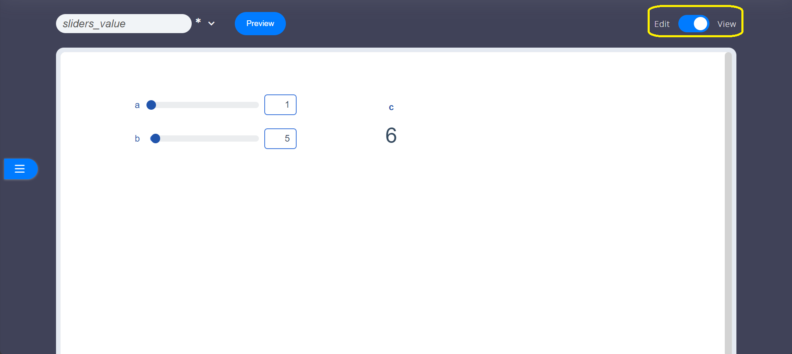

# Simple application

Let this simple Taipy application. Add Taipy Designer (`taipy_designer`) import to activate it.

```python
from taipy.gui import Gui
from taipy_designer import *

a = 1
b = 5
c = a + b

page = DesignerPage("sliders_value.xprjson", designer_mode=True)

gui = Gui()
gui.add_page("page", page)
gui.run(run_browser=True, use_reloader=False)
```

Let's save this code into `simple_app.py`.

This web-application has 3 Python variables: `a`, `b` and `c`. It simply does the addition of `a` and `b` into `c`.

It defines a Taipy Designer page named `sliders_value.xprjson`, that will contain the GUI definition.

It creates a Gui instance from [taipy.gui](https://docs.taipy.io/en/release-3.0/manuals/gui/) to host the Taipy Designer page.

Let's run it first:

```sh
python simple_app.py
```

Taipy Designer is automatically started on the browser at <http://127.0.0.1:5000>.

Let's build its GUI using drag and drop with Taipy Designer.

Widgets are dropped in the *Widgets* main tabset to the dashboard edition zone.



Add two *Horizontal sliders* to the dashboard, from *Basic inputs & controls* category. In the same way, add a *KPI dispay* widget from *Basic Displays* category.

Dashboard shall look like this:


A simple click on the top-right widget's pencil will open its parameterization sidebar. This form is divided into three tabs: **Variables connection** and **Graphical properties** and **Aspect**.


Using this procedure, connect the two sliders to `a` and `b`, and the KPI dispaly to `c`.

To make our dashboard interactive, add the following `on_change` callback as follows:

```python
from taipy.gui import Gui
from taipy_designer import *

a = 1
b = 5
c = a + b

def on_change(state, var, val):
    if (var == "a" or var == "b"):
        state.c = state.a + state.b

page = DesignerPage("sliders_value.xprjson", designer_mode=True)

gui = Gui()
gui.add_page("page", page)
gui.run(run_browser=True, use_reloader=False)
```

Your interactive dashboard is ready. Switch to preview tab to play !




