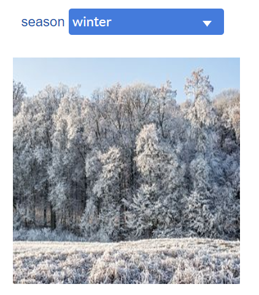

# Annotation & Video

This group includes widgets for graphically annotating the dashboard.

## Label

Label widget allows the user to write multiline text, and apply common widget formatting options if necessary.

## Image

Image widget allows the user to annotate the dashboard by importing *jpg* or *png* images.

When the **enableActuator** parameter is set to *true*, an actuator named **base64Image** appears in the "Data Connection" tab. It allows to display a base64 string encoded image. Animations may be achieved through Python programming.

See example below.

Example :

* [base64-image-py.xprjson](/wdg/annotation/base64-image-py.xprjson)
* [base64-image-js.xprjson](/wdg/annotation/base64-image-js.xprjson)

By default, **keepRatio** parameter is *true*. When set to false, the image ratio is no longer preserved and the image will inherit its container size.

The **hideImageURL** parameter controls the display of the image selection URL in the widget. When an Image widget is dropped on the dashbard, this parameter is set by default to *true* and allows the selection of an image. When an image has been selected, the parameter is automatically set to *false* to avoid any display issues. If another image has be selected, this parameter must be manually set to *true* to re-enable the image selection.

# Markdown

Markdown widget accept a markdown description in the form of string.

Example:

* [markdown-py.xprjson](/wdg/annotation/markdown-py.xprjson)
* [markdown-js.xprjson](/wdg/annotation/markdown-js.xprjson)

# HTML

HTML widget accepts a HTML document description in the form of string.

Example :

* [generic-html-py.xprjson](/wdg/annotation/generic-html-py.xprjson)
* [generic-html-js.xprjson](/wdg/annotation/generic-html-js.xprjson)

## Camera

The main purpose of this widget  is to use the device's camera.

The widget must be connected to a variable and will write information to its **base64Image**, **mimeType** and **imageData** actuators.

Example :

* [video-screenshot.xprjson](/wdg/annotation/video-screenshot.xprjson) 
