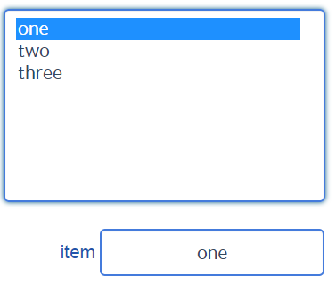

# Basic inputs and controls

**Basic inputs and controls** widgets allow the dashboard end-user to set numeric values (such as [Horizontal slider](#horizontal-slider) or [Numeric input](#numeric-input) widgets), binary values (such as [Checkbox](#checkbox) or [Switch](#switch) widgets) or text values (such as [Text input](#text-input) widget). More complex ones operate on lists or tuples (like [select](#select) or [list](#list)). Some examples are illustrated below.

## Numeric input

**Numeric input** is a numeric input widget, which is intended to operate on the build-in types int and float.

Among its parameters (in tab, "Graphical Properties") :

* *validationButton* : adds a validation button to the right of the widget. When the validation button is clicked, the widget content is written to the connected variable.
* *validationOnFocusOut* : when focus is lost, widget content is written to the connected variable. The default value is *true*.
* *isPassword* : hides edited text as a password
* *decimalDigits* : decimal precision of number. Default value is 3

## Text input

**text input** is a text input widget, which is intended to operate on the build-in types int and float.

Among its parameters (in tab, "Graphical Properties") :

* *validationButton* : adds a validation button to the right of the widget. When the validation button is clicked, the widget content is written to the connected variable.
* *validationOnFocusOut* : when focus is lost, widget content is written to the connected variable. The default value is *true*.
* *isPassword* : hides edited text as a password

## Horizontal slider

**Horizontal slider** allows to set the value of a variable field of primitive datatype "number", between its *min* and *max* parameters. The *step* parameter controls the slider increment value.

## Vertical slider

Similar to the [Horizontal slider](#horizontal-slider) above with a different orientation.

## Double slider

This slider has two handles, allowing to set both a *minValue* and a *maxValue* ranging between the values of *minRange* and *maxRange* parameters. When *rangeActuator* parameter is set to *true*, new *minRange* and *maxRange* actuators appear in the "Data connection" tab, enabling to set these actuators from other Python variables.

## Checkbox

**Checkbox** widget allows to set the value of a boolean variable field.

## Switch

Similar to [Checkbox](#checkbox)

## Simple switch

Allows to set discrete boolean values.

## Push button

**Push button** 

The button works as a trigger for connected Python functions (i.e. when the user clicks the button, bound function execution is forced)

## Select

**Select** widget has three actuators:

* **keys**: a list or tuple describing the options that can be selected.
* **values**: a list or tuple the corresponding values that can be written. This actuator is optional.
* **selectedValue**: the variable where the selected output will be written, the selected *key* or its corresponding *value*, if a list or tuple of values has been specified.

With the following list of **keys**

``` python
["choice1", "choice2"]
```

and an (optional) list or tuple of **values** that the widget will output to the **selectedValue** actuator when the corresponding option is selected.

``` python
[1, 2]
```

If **values** actuator is not specifed, the **selectedValue** will contain the value of the item selected in the **keys** list.
Otherwise, the **selectedValue** will contain the item from the **values** list or tuple corresponding to the selected key.

* [select_combo.py](/wdg/basic/select_combo.py)


## List

**List** widget expects a list or a tuple as its **value** input, such as :

``` python
["one", "two", "three"]
```

**selectedValue** specifies the variable that will contain the selected item from the list.



Example :

* [list.py](/wdg/basic/list.py)

## Multi-select

Example :

* [multi_select.py](/wdg/basic/multi_select.py)

## Editable Table

**Editable Table** widget expects its **value** input to reference a list, containing sub-lists, all of the same dimension, such as :

``` python
[
    ["Jan", "Feb", "Mar", "Apr", "May", "Jun", "Jul", "Aug", "Sep", "Oct", "Nov", "Dec"],
    [5, 6, 9, 11, 15, 16, 20, 20, 16, 12, 7, 5]
]
```

This array will be displayed as :


Table is fully editable by default. *Editable* property can be set in a column-basis using the parameter *editableCols*. For example, if editableCols equals [0,1,2], columns 0, 1 and 2 are editable (i.e. cells in these columns, excluding headers, can be modified). The modifications will be assigned to the connected variable.

Editable tables may also be two dimentional.


Example : [editable_table.py](editable_table.py)


