# Geo & Time

This category includes widgets related to location, date and time.

## Leaflet JSON maps

**Leaflet JSON maps** widget has rich and versatile features for displaying various information on maps. It also has selection and interaction features. It is based on [Leaflet](https://leafletjs.com/) library and its various plugins.

When a new **Leaflet JSON maps** widget is added to the dashboard, only one actuator named **geoJSON1** is available in the "Data connection" tab. But this widget allows up to 6 types of display layers, according to the value of the associated parameter *numberOfLayers*. This parameter can be set in the "Graphical properties" tab as shown in the following picture:

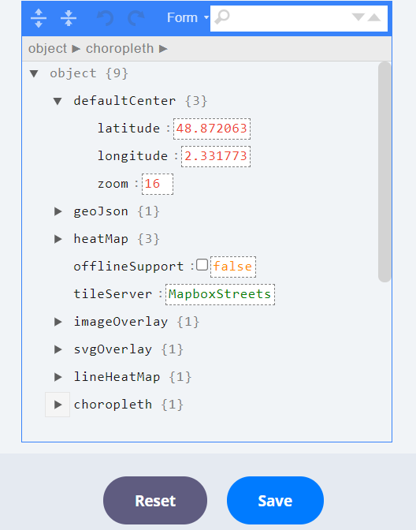

Depending on the parametrization, new actuators may appear in "Data connection" tab and offer :

* 0 to 8 possible layers of [GeoJSON](#geojson-layers) objects. Writing GeoJSON objects is described [here](https://en.wikipedia.org/wiki/GeoJSON).
* 0 to 8 possible layers of [heatMap](#heatmap-layers) objects
* 0 to 8 possible layers of [lineHeatMap](#lineheatmap-layers) objects
* 0 to 8 possible layers of [choropleth](#choropleth-layers) objects
* 0 to 8 possible layer of [imageOverlay](#imageoverlay-layers) objects
* 0 to 8 possible layer of [svgOverlay](#svgoverlay-layers) objects

In addition to these pure display layers, selection controls can be activated by enabling the [drawingFeatures](#drawing-features) option. Regions of the map can thus be selected using the mouse. When this option is enabled, the **selectedGeoJson** actuator receives user selection as geoJson, and needs to be connected to a variable. This features are based on the [Geoman](https://geoman.io/) plugin.

Enabling the *drawingFeatures* option enables the **drawingFeaturesOptions** parameters set which manages selection options (point, line, polygone, rectangle).

Other parameters :

* **offlineSupport** : displays controls on the maps that allow to store tiles for the current displayed geographic area. Useful when using the map offline (i.e. with no Internet connection)
* **tileServer** : currently there is support for *MapboxStreets* and *HereHybridDay*

### geoJson layers

geoJson1 to geoJson8 inputs expect a geoJson object. Basic examples are shown below.

#### Point

Single point on a single layer of the map

``` python
point = {
  "type": "FeatureCollection",
  "features": [
    {
      "type": "Feature",
      "geometry": {
        "type": "Point",
        "coordinates": [
          2.295,
          48.8738
        ]
      },
      "properties": {
        "html": "See <a href=\"https://en.wikipedia.org/wiki/Place_Charles_de_Gaulle\" target=\"_blank\">Place Charles de Gaulle</a>",
        "awesomeMarker": {
          "icon": "fa-asterisk",
          "prefix": "fa",
          "markerColor": "red"
        }
      }
    }
  ],
  "properties": {
    "description": "Arc de triomphe",
    "disableAutoscale": False
  }
}
```

which will be displayed as :

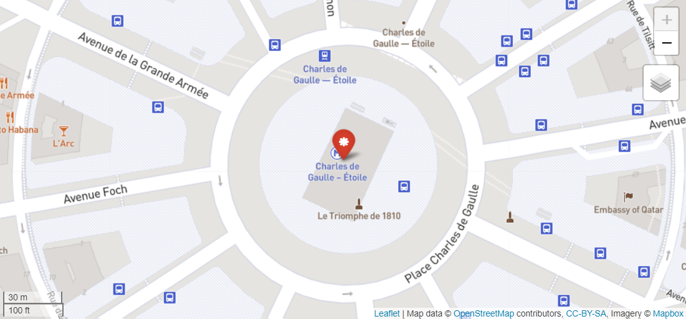

Properties field of each feature allows to configure it. It comprises the following items :

- **html** : allows to write html call to be rendered inside the popup.
- **awesomeMarker** : JSON configuration object for the [Leaflet.awesome-markers](https://github.com/lvoogdt/Leaflet.awesome-markers) library, allowing colorful iconic & retina-proof markers for Leaflet, based on the Glyphicons / Font-Awesome icons. **Only Font-Awesome icons** are supported with Chalk'it.

  | Property        | Description            | Default Value | Possible  values                                     |
  | --------------- | ---------------------- | ------------- | ---------------------------------------------------- |
  | icon            | Name of the icon       | 'home'        | See glyphicons or font-awesome                       |
  | prefix          | Select the icon library| 'glyphicon'   | 'fa' for font-awesome or 'glyphicon' for bootstrap 3 |
  | markerColor     | Color of the marker    | 'blue'        | 'red', 'darkred', 'orange', 'green', 'darkgreen', 'blue', 'purple', 'darkpurple', 'cadetblue' |
  | iconColor       | Color of the icon      | 'white'       | 'white', 'black' or css code (hex, rgba etc) |
  | spin            | Make the icon spin     | false         | true or false. Font-awesome required | 
  | extraClasses    | Additional classes in the created <i> tag | '' | 'fa-rotate90 myclass' eller other custom configuration |

Examples :

* Single point : [osm_geojson_point.py](/wdg/maps/osm_geojson_point.py)
* Multiple points : [osm_geojson_points.py](/wdg/maps/osm_geojson_points.py)
* Awesome markers : [osm-geojson-point-awesome-marker.py](/wdg/maps/osm_geojson_point_awesome_marker.py)
* Disable autoscale with geoJSON point : [osm_geojson_point_disable_autoscale.py](/wdg/maps/osm_geojson_point_disable_autoscale.py)

#### Line

Single line on a single layer of the map

``` python
line = {
  "type": "FeatureCollection",
  "features": [
    {
      "type": "Feature",
      "geometry": {
        "type": "LineString",
        "coordinates": [
          [
            2.295,
            48.8738
          ],
          [
            2.321125,
            48.865487
          ]
        ]
      },
      "properties": {
        "style": {
          "color": "#FF0000",
          "weight": 4,
          "opacity": 1
        }
      }
    }
  ],
  "properties": {
    "description": "<span style=\"color: #FF0000\">Champs-Élysées</span>"
  }
}
```

which will be displayed as :

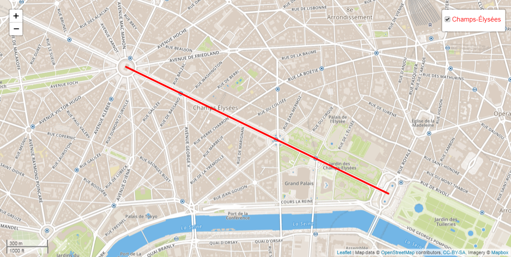

Examples :

* Single line : [osm_geojson_line.py](/wdg/maps/osm_geojson_line.py)
* Multiple lines :  [osm_geojson_lines.py](/wdg/maps/osm_geojson_lines.py)

#### Polygon

A polygon on a single layer of the map

``` python
polygon = {
  "type": "FeatureCollection",
  "features": [
    {
      "type": "Feature",
      "geometry": {
        "type": "Polygon",
        "coordinates": [
          [
            [
              2.300815,
              48.871943
            ],
            [
              2.30158,
              48.864638
            ],
            [
              2.310094,
              48.868996
            ]
          ]
        ]
      },
      "properties": {
        "style": {
          "color": "#01DF01",
          "weight": 4,
          "opacity": 0.9,
          "fillColor": "#01DF01",
          "fillOpacity": 0.4
        }
      }
    }
  ],
  "properties": {
    "description": "<span style=\"color: #01DF01\">Triangle d'or</span>"
  }
}
```

which will be displayed as :

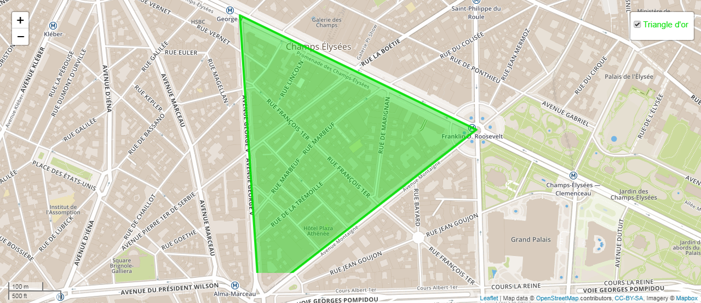

Example :

* [osm_geojson_polygon.py](/wdg/maps/osm_geojson_polygon.py)

See also : [Using GeoJSON with Leaflet](https://leafletjs.com/examples/geojson/)

### heatMap layers

*heatMap1* to *heatMap8* inputs expect a JSON object like the following one :

``` python
heatmap = {
  "data" : [
    {
    "lat": 44.78857833333333,
    "lng": 0.20539333333333332,
    "H2O": 58.0183
    },
    {
    "lat": 44.78858,
    "lng": 0.20539333333333332,
    "H2O": 58.0187
    }
  ],
  "config": {
    "opacity": 0.5,
    "radius": 1,
    "disableAutoscale": False,
    "min": 0,
    "max": 100,
    "colorScale": "interpolateSpectral",
    "reverseColorScale": True
  }
}
```

When **min** and/or **max** config parameters are not specified, they are automatically computed from the data set. **colorScale** is a string from interpolate-type colorscales of D3.js : <https://github.com/d3/d3-scale-chromatic>.

Example of display (for a larger data set) :

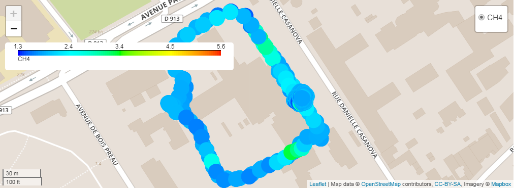

Example :

* [osm_heatmap_view.py](/wdg/maps/osm_heatmap_view.py)

Several parameters control the display of the heatmap, in particular :

### lineHeatMap layers

*lineHeatMap1* to *lineHeatMap8* inputs expect a JSON object like the following one :

``` python
line_heatmap = {
  "data": [
    {
      "coordinates": [
        [
          4.84112,
          45.74968
        ],
        [
          4.84091,
          45.74981
        ]
      ],
      "CO2": 6
    },
    {
      "coordinates": [
        [
          4.84138,
          45.74953
        ],
        [
          4.84112,
          45.74968
        ]
      ],
      "CO2": 10
    }
  ],
  "config": {
    "opacity": 0.9,
    "weight": 4,
    "disableAutoscale": False,
    "min": 0,
    "max": 10,
    "colorScale": "interpolateSpectral",
    "reverseColorScale": True    
  }
}
```

When **min** and/or **max** config parameters are not specified, they are automatically computed from the data set. **colorScale** is a string from interpolate-type colorscales of D3.js : <https://github.com/d3/d3-scale-chromatic>.

Example of display:

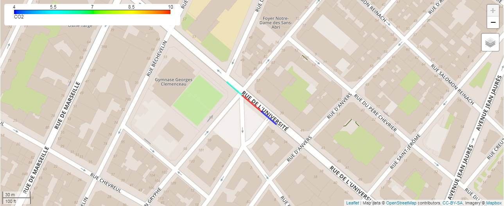

Example :

* [osm_lineheatmap.py](/wdg/maps/osm_lineheatmap.py)

### Choropleth layers

*choropleth1* to *choropleth8* inputs expect a JSON object like the following one :

``` python
choropleth = {
  "data": [
    {
      "geometry": {
        "type": "Polygon",
        "coordinates": [
          [
            [
              2.329144745999656,
              48.87299590267482
            ],
            [
              2.329453736347205,
              48.8723745764414
            ],
            [
              2.331221849053691,
              48.8721034501072
            ]
          ]
        ]
      },
      "CO2": 6
    },
    {
      "geometry": {
        "type": "Polygon",
        "coordinates": [
          [
            [
              2.331445008712763,
              48.87264570173727
            ],
            [
              2.332766800791433,
              48.870849470245
            ],
            [
              2.3349983986918237,
              48.87142562719721
            ]
          ]
        ]
      },
      "CO2": 10
    }
  ],
  "config": {
    "opacity": 0.9,
    "weight": 4,
    "disableAutoscale": False,
    "min": 0,
    "max": 10,
    "colorScale": "interpolateOranges",
    "reverseColorScale": False
  }
}
```

When **min** and/or **max** config parameters are not specified, they are automatically computed from the data set. **colorScale** is a string from interpolate-type colorscales of D3.js : <https://github.com/d3/d3-scale-chromatic>.

Example of display (for a larger data set) :

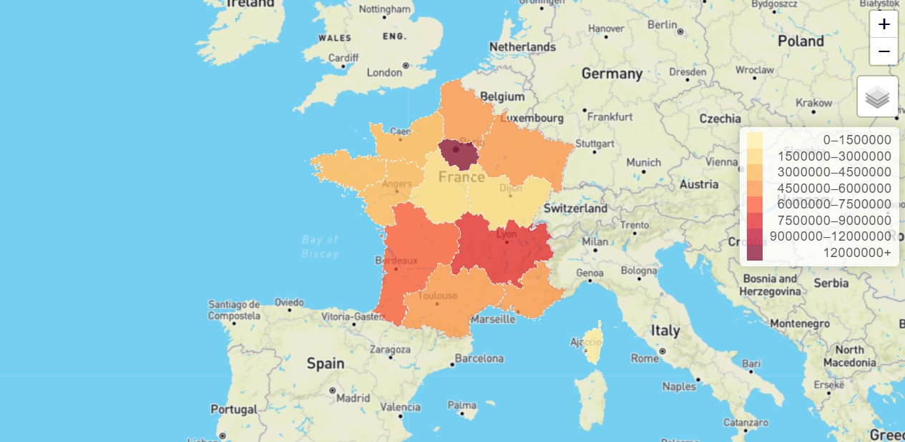

Example :

* [osm_choropleth.py](/wdg/maps/osm_choropleth.py)

### imageOverlay layers

*imageOverlay1* to *imageOverlay8* inputs expect a geoJson object like the following one :

``` python
{
    "imageUrl" = "http://www.fondation-tuck.fr/upload/docs/image/jpeg/2015-01/logo-ifpen.jpg";
    "imageBounds" = [
        [48.874875, 2.171738],
        [48.877923, 2.179484]
    ];
    "title" = "IFPEN location";
    "addAs" = "overlay"; // overlay or baseLayer
}
```

As shown in the code snippet above, the **addAs** parameter may take two values:
 *overlay* which adds a checkbox control, or *baseLayer* which adds a radio button control.

Example :

* [osm_image_overlay.py](/wdg/maps/osm_image_overlay.py)

### svgOverlay layers

*svgOverlay1* to *svgOverlay8* inputs expect a JSON object like the following one :

``` python
{
  "data": 
  [
    {
      "lat": 48.876684999999995,
      "lng": 2.175765,
      "rotation": 255
    },
    {
      "lat": 48.876684999999995,
      "lng": 2.175765,
      "rotation": 256
    }
  ],
  "config": {
    "marker": "arrow",
    "title": "Wind direction",
    "opacity": 0.5,
    "length": 9.3,
    "disableAutoscale": False,
    "addAs": "overlay" # overlay or baseLayer
  }
}
```

Example of display (for a larger data set) :

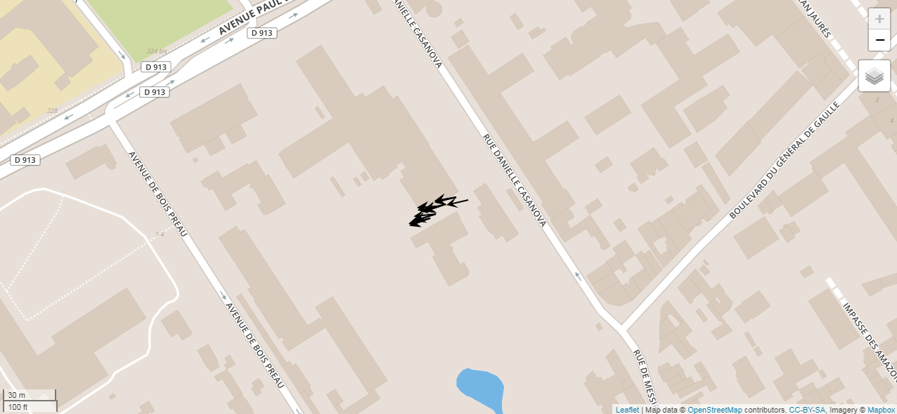

Example :

* [osm-svg_layer_view.py](/wdg/maps/osm_svg_layer_view.py)

### Drawing features

It is possible to allow the user to manually select points, lines, rectangles or polygone regions in the map. This is possible by enable the *drawingFeatures* option.

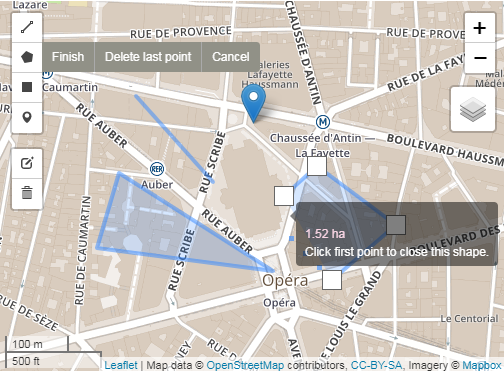

Selection result will be written to the *selectedGeoJson* actuator.

Example :

* [osm_drawing_features.py](/wdg/maps/osm_drawing_features.py)

## Folium Maps

[Folium](https://python-visualization.github.io/folium/
) is a Python library used for visualizing geospatial data. It leverages the power of the Leaflet.js library and provides a simple way to create interactive maps. Folium can be used to create various types of maps such as choropleth maps, bubble maps, and scatter maps, and provides an easy-to-use interface for adding markers, popups, and other interactive features to the maps.

Folium is built on top of the Python data analysis library pandas, which makes it easy to manipulate and visualize large datasets. It also supports several tilesets such as OpenStreetMap, Mapbox, and Stamen, which can be used to customize the look and feel of the maps.

Usage examples:

* [folium-point.py](/wdg/maps/folium_point.py)

## Address autocompletion

This widget uses the [here geocoder autocomplete API](https://developer.here.com/documentation/geocoder-autocomplete/dev_guide/topics/example-location-id.html) to provide suggestion as the user types an address location.

The parameter *countryIsoCodes* restricts the provided suggestions to the specifed country.

## Simple calendar

Use the *Simple calendar* widget to select a date.

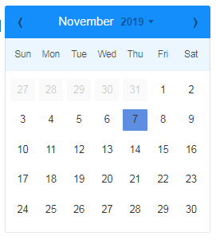

Example :

* [date_picker.py](/wdg/date-time/date_picker.py)

## Date-range calendar

Enables the selection of a date interval.

## D3 year heatmap caldendar

Allows to associate range heatmap to a yearly-based calendar. Very useful to visually identify sporadic information. Date selection is also possible. 

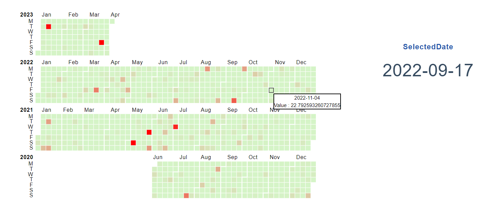

Example :

* [d3_year_heatmap_calendar.py](/wdg/date-time/d3_year_heatmap_calendar.py)

## Simple clock

Use the *Simple clock* widget to select a time.

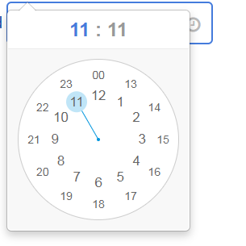

Example :

* [time_picker.py](/wdg/date-time/time_picker.py)