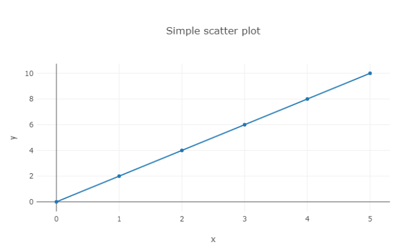
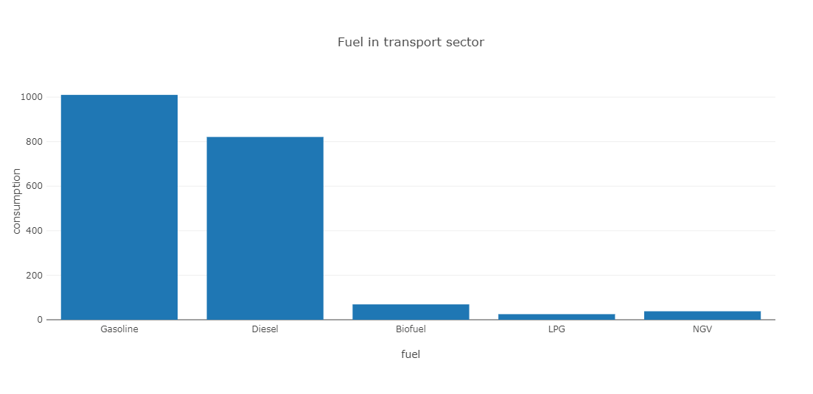
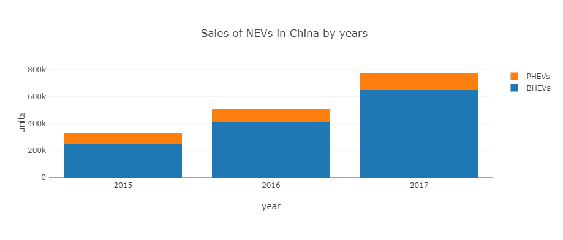
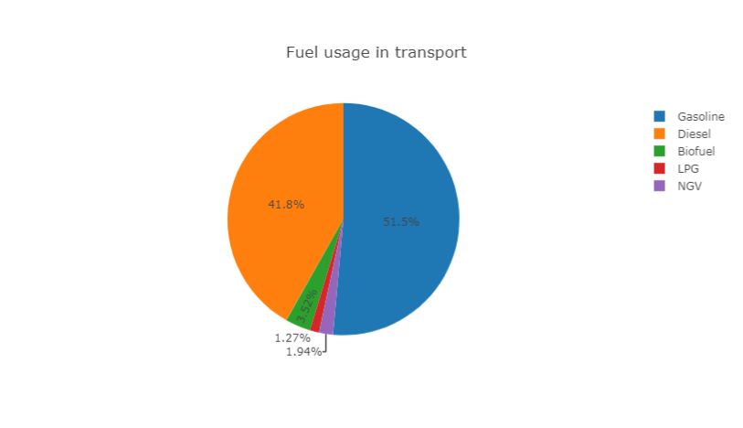

# Plots

Plots in Chalk'it lite may be made with the following widget types:

* Python-based plots are available using [Plolty Python](https://plotly.com/python/) or [Matplotlib](https://matplotlib.org/)
* Simplified usage (array actuators) is available for [Plotly line](#plotly-line), [Plotly bar](#plotly-bar), [Plotly pie](#plotly-pie) and [Plotly 3D surface](#plotly-3d-surface). Otherwise, use the [Plotly Python generic](#plotly-python-generic) for a complete Plotly.js options and configurations
* JavaScript-based plots are available [Apache ECharts](https://echarts.apache.org/). They are usable by writing Python code with JSON-like dicts.


Plotly-based widgets share common parameters, especially *hideModeBar* which allows to hide plot options toolbar at dashboard play.

## Plotly line

Allows to quickly display line charts, when x and y axis are expressed as lists of numbers. The parameter *numberOfAxis* allows to specifiy up to 8 y-axis actuators (named **y1** to **y8**), sharing the same x-axis actuator (named **x**). Widget layout may be configured in the "Graphical properties" tab.

* [line_chart.py](/wdg/plotly/line_chart.py)



## Plotly bar

Here parameter *numberOfAxis* allows to specify couples of x and y axis actuators (named **x1**, **y1** to **x8**, **y8**).

Some examples :

* [bar_chart.py](/wdg/plotly/bar_chart.py)



* [stack_bar_chart.py](/wdg/plotly/stack_bar_chart.py)



## Plotly pie

This widget has two actuators :

* **values**: an list of values to be displayed as pie chart
* **labels**: an optional list of labels associated to values



Example :

* [pie_chart.py](/wdg/plotly/pie_chart.py)

## Plotly Python Generic

This widget expects a Plotly figure Python object. Below a code example: 

```python
import plotly.express as px

df = px.data.gapminder().query("country=='Canada'")
fig = px.line(df, x="year", y="lifeExp", title='Life expectancy in Canada')

return fig
```

All receipes may be found in [Ploty Python documentation](https://plotly.com/python/line-charts/).

No call to `fig.show()` is needed because rendering process will be entirely handled by Chalk'it lite according to its rendering rules.

Example:

- [plotly_density_heatmap.py](/wdg/plotly/plotly_density_heatmap.py)

## Matplotlib

In the same way as Plotly Python widget, Matplotlib widget expect a figure object as actuator. Below a code example:

```python
import matplotlib.pyplot as plt

fig, ax = plt.subplots()

fruits = ['apple', 'blueberry', 'cherry', 'orange']
counts = [40, 100, 30, 55]
bar_labels = ['red', 'blue', '_red', 'orange']
bar_colors = ['tab:red', 'tab:blue', 'tab:red', 'tab:orange']

ax.bar(fruits, counts, label=bar_labels, color=bar_colors)

ax.set_ylabel('fruit supply')
ax.set_title('Fruit supply by kind and color')
ax.legend(title='Fruit color')
```

All receipes may be found in [Matplotlib documentation](https://matplotlib.org/stable/gallery/index.html).

- No call to `plt.show()` is needed because rendering process will be entirely handled by Chalk'it lite according to its rendering rules.

Example:

- [matplotlib-bar-color.py](/wdg/plots/matplotlib-bar-color.py)

## ECharts

Simply, copy and paste the needed visualization from [ECharts examples gallery](https://echarts.apache.org/examples/en/index.html) and convert it to Python. This example shall return an *option* JSON according to ECharts grammar. Finally, connect this variable to the **option** widget actuator.

Some examples:

* [echarts-covid-comparison.py](/wdg/plots/echarts-covid-comparison.py)